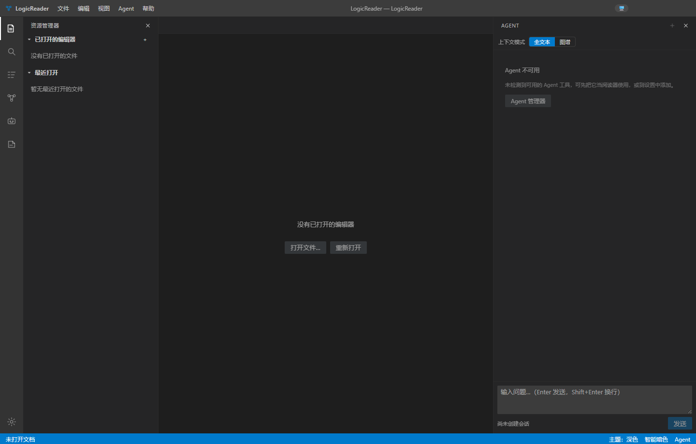
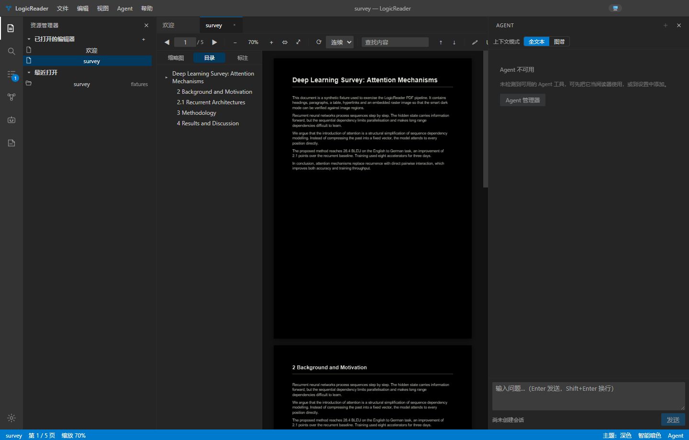
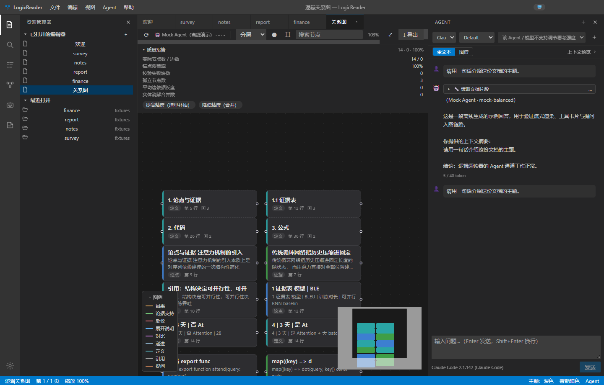
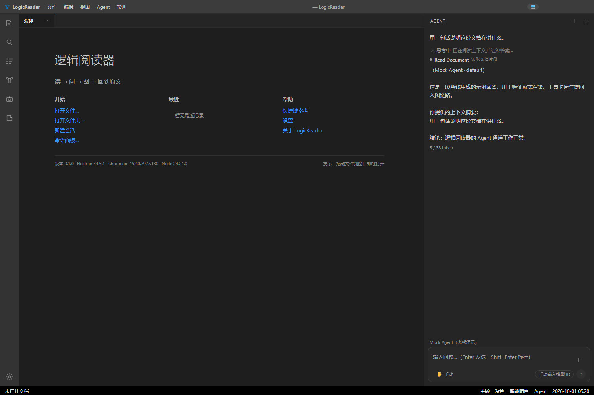
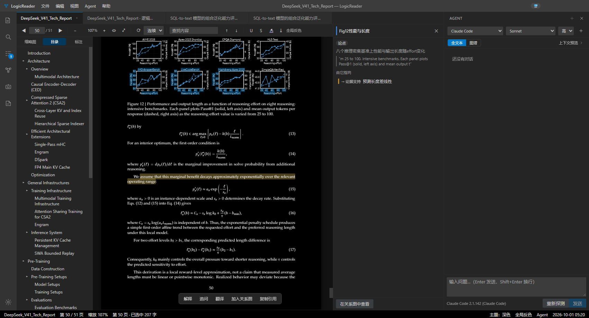

# 逻辑阅读器 / LogicReader

> 会画逻辑图的本地文档阅读器 —— 把 PDF / Markdown / Word / PPT / Excel 变成可深读的对象，
> 调用本机已安装的 AI Agent 通读全文，产出一张**可交互、可跳转、可追问**的逻辑关系图。

本仓库为《逻辑阅读器-任务规划书.md》（v1.3）的工程实现。



**文档不出本机。** 除了你主动发起的 Agent 调用，程序不联网；关系图、标注、对话全部存在本机 SQLite 里。

## 下载（免安装）

到 [Releases](../../releases) 下载 `LogicReader-<版本>-portable.zip`，解压后双击 `LogicReader.exe` 即可 —— 无需安装，也不需要管理员权限。

- 首次运行若弹「Windows 已保护你的电脑」：点「更多信息 → 仍要运行」（产物未签名，见下方《Windows 安全提示》）。
- 双击 exe 毫无反应时，双击同目录的 `启动逻辑阅读器.cmd`：它按「正常 → 关沙箱 → 便携数据目录」三档自动降级启动。

## 它是什么

传统阅读器解决的是「**把字显示出来**」，LogicReader 想解决的是「**把逻辑读出来**」：

| 痛点 | 本项目的做法 |
| --- | --- |
| 读长文档时在细节里迷路，看不清论证骨架 | 通读全文生成**可交互的逻辑关系图**，每个节点与每条边都带原文锚点 |
| 想问「这一段在说什么」，却要手动复制上下文、还得自己描述位置 | 选中文字即可提问，**位置描述头自动注入**，Agent 永远知道你在指哪一段 |
| AI 的回答读完就散，回不到原文 | 图中节点/连线可**跳回原文并高亮**，文段旁给出局部逻辑链 |
| 多个 Agent 各自为政，被迫在多个客户端之间搬运文本 | 统一接入本机已装的 Agent，**不绑定任何模型厂商** |

闭环就是四个字：**读 → 问 → 图 → 回到原文**。

## 界面

| | |
| --- | --- |
|  |  |
| PDF 阅读（三档暗色，支持黑底白字） | 逻辑关系图（节点带类型、连线带关系标签） |
|  |  |
| Agent 面板（思考 / 工具调用各占一行） | 从关系图跳回原文，右侧给局部逻辑链 |

## v0.3.0 新增能力

**阅读与查找**

- **跨文档全文检索（SQLite FTS5）**：从"只搜当前文档"扩展到**在所有读过的文档里找句子**，命中直接跳回原文。
- **表格视图改窗口渲染**：解除原来 2000 行的硬上限，大表也能从头读到尾；解析库升级到带安全修复的版本（SheetJS 0.18.5 → `@e965/xlsx` 0.20.3）。
- **PDF 侧栏拆成两块独立面板**（缩略图 / 标注）：可同时存在、可整体关闭，工具栏上给唤起按钮 —— 原来只能三选一，还想看一眼标注就得来回切。
- **主题收尾**：浅色模式下没跟着切浅的三处（活动栏 / 窗口按钮 / 状态栏）修好；关系图的缩放控件跟随主题；状态栏的「主题」项改为真正切换**应用主题**（此前点它只改阅读区，界面纹丝不动）。

**Agent**

- **授权档位按各 Agent 自己提供的功能渲染**：Claude Code 是四档，Codex / DeepSeek Harness 按各自官方协议实际提供的能力生成选项，并且**真的调用**（不再照搬 Claude 的四档）。
- **不再内置官方 Claude Code CLI（236 MB）**：产物里不再携带 Anthropic 的二进制（许可与"Agent 中立"两方面的考量）；装了 Claude Code 的用户照常可用，没装的用户仍拿到一个完整阅读器。
- 文档 ↔ 默认会话的绑定改从**数据库**恢复（有默认会话就直接显示，不再重复询问）；重开 Agent 面板不再自动跳到会话底部；历史回放里不再把"我们注入的授权模式提醒"当成用户提问。

**关系图**

- **按社区聚合（Louvain）接通超级节点**：大图默认折叠成社区，双击下钻。
- 链上跳转按「**离当前阅读位置最近**」的那一处出处挑目的地（此前只认第一条出处）。
- ACP 报文翻译与官方协议类型对账；新增一条「JSON Schema 与实现不许各自漂移」的测试闸门。

**一批"不合人类逻辑/审美"的修复（18 条）**

首启向导的按钮语义与出口、向导只在真正首次启动时出现、**打开文档不再默默发一轮真实请求**（按用户裁决改为询问卡片）、Agent 底部 chip 的残句、PDF 工具栏用字符当图标、空态里的开发注释 `// TODO`、状态栏没有标签的时间戳、关系图打开时三层浮层全开、表格阅读器不适配、`Esc` 不再全局掐断正在跑的回合、若干重复入口与零引用文案。

## v0.2.0 新增能力

**阅读与对话**

- **文档默认会话**：打开文档后自动发起首轮「通读」——以全文为上下文，先给一份总结理解与阅读参考（重点章节 / 阅读顺序 / 前置概念）；之后所有提问都落在这条会话里，同一篇论文共用一个历史对话。要另起一条时手动点「新建会话」。
- **提问更醒目、可跳转**：用户提问在右侧以圆角气泡呈现；带原文锚点时点一下就跳回「提问当时那一段」。上下文占用显示**真实 token**（Claude Code / Codex / dsh 三条通道各自的真实数据源），拿不到真实值时会明确标注"按文档体量估算"，不把文档大小当成对话占用。
- **失败回合可重试**；历史会话**点开即看全部对话**（dsh 从它自己的会话日志回放、Claude Code 走官方接口），并支持**重命名 / 删除**（改名支持回车确定）。

**关系图**

- **耗时预估基于本机历史校准**（同文档最近 3 次成功记录 + 思考强度系数），生成过程中有滚动 ETA；预估面板会说明依据是"历史校准"还是"首次启发式"。
- **「重试失败块」只重跑失败的那几块**，并严格复现原图的生成配置（分块大小 / 关系白名单 / 抽取范围），已抽出的实体、连线与人工编辑原样继承 —— 重试不再等于整篇重烧。
- **节点多出处**：同一概念在多处出现时保留全部原文位置，位置选择器对节点也真正可用；"引文对、坐标错"的条目会**按引文重新锚定**，不再整条丢弃。

**Agent 与交互**

- 计划卡片支持**手动修改**（改完直接执行）与**取消**；
- 「停止」改为三步降级（发出取消 → 等 3 秒 → 强制收尾 → 再等 2 秒才杀进程）：停得下来，而且**停止后会话仍然可用**；
- 选区浮动工具条**跟着选区走**（贴在选区上方，不再挡住正文）；
- 新建会话的入口全部接通（Agent 菜单 / 面板头部 ＋ / 快捷键标注修正）。

**对话入图**

- 每次提问都会在关系图上生成 `inquiry` 节点，标题取**核心诉求**（历史列表也只显示核心诉求，而发给 Agent 的原文完整不减）；重新生成关系图时这些对话节点会被**继承**，不会被冲掉。

## 快速开始

```bash
# 1) 安装依赖（已配置 npmmirror 镜像，内网环境友好）
pnpm install

# 2) 开发模式（electron-vite dev，支持 HMR）
pnpm dev

# 3) 类型检查 + 单元测试
pnpm typecheck
pnpm test

# 4) 生产构建
pnpm build

# 5) 打包 Windows 免安装目录 / 安装包
pnpm build:unpack     # 产出 release/win-unpacked/LogicReader.exe（已验证可运行）
pnpm publish:local   # 镜像产物到 D:\Apps\LogicReader（工作区外干净目录），双击即可运行
pnpm build:win        # 产出 NSIS 安装包与 portable 单文件
```

> 说明：仓库根目录即应用目录，`pnpm-workspace.yaml` 只声明了 `packages/*` 三个内部包。
> 产物**不内置官方 Claude Code CLI**（236 MB）：装了 Claude Code 的用户照常可用，没装的用户仍是一个完整阅读器，见《许可与第三方组件》。

## 目录结构

```
apps/
  main/       Electron 主进程：文件服务、SQLite 持久化、会话快照、Agent 运行时（官方 Claude Agent SDK / Codex app-server / 自研 ACP / CLI 兜底 四条通道）、关系图服务
  preload/    contextBridge 白名单 API（contextIsolation + sandbox）
  renderer/   React 工作台：五区布局、各格式阅读器、关系图画布、Agent 面板
packages/
  shared/          跨进程共享类型、IPC 通道、设置模型、命令 ID、i18n 令牌
  document-model/  统一块模型、归一化、锚点三重重定位、分块（含单测）
  graph-schema/    节点/边受控词表、精度档位、JSON Schema 与校验（含单测）
resources/icons/   应用图标（ICO / PNG）
scripts/           构建辅助脚本（ensure-electron / publish-local / trust-windows / launch-doctor / make-shortcut）
scripts/launcher/  产物自带的三档启动器（启动逻辑阅读器.cmd + LogicReader-Launcher.ps1）
scripts/fixtures/  测试夹具与图标的生成脚本（PDF / DOCX / XLSX / PNG / ICO）
tests/fixtures/    样本文档（PDF / Markdown / DOCX / XLSX）
docs/screenshots/  各里程碑与修复的验证截图
out/               构建产物（electron-vite 输出，可再生，已 gitignore）
release/           Windows 免安装程序（electron-builder 输出，已 gitignore）
```

## 功能一览（对照规划书）

| 里程碑 | 内容 | 状态 |
| --- | --- | --- |
| M0 | Electron + Vite + React + TS；VS Code 五区工作台；深浅主题；命令面板；中英 i18n；electron-builder 打包 | ✅ 已验收 |
| M1 | PDF.js 渲染管线；连续/单页/双页；缩放/旋转；缩略图；目录；查找；标注（下划线/删除线/便签/矩形/箭头；**高亮已按产品决定下线**，见避坑指南 §4.3.2.2）；**三档暗色（含智能暗色 + 图像保护）**；带标注 PDF 导出（pdf-lib） | ✅ 已验收 |
| M2 | Markdown（GFM/任务列表/表格/公式/Shiki 懒加载高亮）；DOCX（docx-preview + OOXML 块解析）；XLSX（多 Sheet、冻结表头、公式）；纯文本；统一块模型与锚点系统 | ✅ 已验收 |
| M3 | ACP 客户端（stdio JSON-RPC）；CLI 兜底（claude / codex / dsh / gemini）；能力探测（Windows `.cmd` shim 解析、PATH 修正、版本探测）；对话 UI（流式、思考、工具卡片、权限卡片、停止）；Mock Agent | ✅ 已验收 |
| M4 | 抽取管线（分块 → Map → 校验重试 → Reduce 消解 → 锚点 → 持久化）；React Flow 画布；ELK/d3-force/径向布局（Worker）；质量报告；人工编辑（重命名 / 改类型 / 删除 / **拖拽手工连线** / 关系说明）；**导出 JSON/Markdown/SVG/PNG（透明）/JPG（画布底色）** 与导入 | ✅ 已验收 |
| M5 | 两种上下文模式（全文本 / 图谱）；上下文预览；选区浮动工具条；位置描述头自动注入；提问入图（inquiry 节点 + 连边） | ✅ 已验收 |
| M6 | LibreOffice sidecar 调用与缓存（缺失时友好降级）；首启向导四步；打包与图标 | ✅ 已验收 |
| M7 | 会话快照与恢复（窗口/布局/标签/阅读位置/图视口/草稿）；i18n 缺失键自检 | ✅ 已验收 |
| M8 | **PDF 文本层定稿**：DOM 文本层用官方 pdf.js `TextLayer`（复刻其运行环境），几何与字符偏移由矢量内容流算出（`pdfVectorText` + 带版本与文本指纹的持久化映射）；四种阅读器共用选区解析（内容对齐）；启动三级降级（软件渲染 → 关沙箱 → 单进程）+ **同一次启动内自动恢复，标准用户即可运行、不需要管理员** | ✅ 已完成 |

## 关键设计

- **地基：统一文档模型与锚点**（`packages/document-model`）。所有阅读器把内容切成块，块带全局字符偏移与格式特有定位符；锚点支持"哈希命中 → 引文精确 → 相似度模糊 → stale"四重定位。
- **硬门槛：无锚点不入图**。抽取结果的 spans 必须落在当前分块的全局区间内，否则整条丢弃（`packages/graph-schema/src/validate.ts`）。
- **Agent 中立**：模型与思考强度来自 Agent 自身的声明（ACP `configOptions`）或原生参数映射，产品不硬编码模型名。
- **能力探测与降级**：未装 LibreOffice 时 `.doc/.ppt` 走引导页而非崩溃；未装任何 Agent 时产品仍是完整阅读器。
- **会话三层持久化**：SQLite（内容实时落库）/ `session.json`（界面与位置，原子写 + 备份 + 锁文件判定崩溃）/ 内存易失状态。
- **文本层：位置交给官方，算术留给自己**：DOM 文本层用 pdf.js 官方 `TextLayer`，但必须**完整复刻它的运行环境**（`.textLayer` 类名、`--scale-factor`/`--total-scale-factor`、容器宽高 = 视口尺寸）——直接当库用会整体偏移且不报错，自研两版同样偏移、已放弃。几何与字符偏移一律由内容流矢量算出（`lib/pdfVectorText.ts`），经 `lib/textLayerMapping.ts` 持久化（版本 + 文本指纹，抽样自证不通过就整批丢弃现算）。
- **启动降级与自恢复（标准用户即可，全程不需要管理员权限）**：先按正常形态启动；渲染进程起不来时在**同一次启动内**自动恢复 —— ① 关掉窗口级沙箱（`webPreferences.sandbox=false`）重开窗口，② 仍然失败就用 `--no-sandbox` 重启自己一次；结论落盘 `userData/render-fallback.json`，后续启动在 `app ready` 之前直接生效，连渲染子进程都创建不出来时再升到单进程档。用户只需双击一次，不必"再打开第二次"，更不必右键以管理员身份运行。
- **文档默认会话与对话入图**：打开文档即自动通读一轮（全文上下文 + 总结理解与阅读参考），后续提问默认共用一个会话；每次提问沉淀为图上 `inquiry` 节点，重生成关系图时被继承 —— 对话以"只读 + 累积"的方式参与图，而不是把问答文本混进每块的抽取提示词（多烧 token，弱模型还会把它当正文抽）。

## 相关文档

| 文档 | 内容 |
| --- | --- |
| [ARCHITECTURE.md](ARCHITECTURE.md) | **长期记忆**：稳定约定与不变量、模块职责、启动顺序、验证矩阵、已知边界 |
| [执行记录.md](执行记录.md) | 逐里程碑落地情况、验收证据、与规划书的偏差、各轮反馈的根因分析与修复记录 |
| [避坑指南.md](避坑指南.md) | 实战踩坑总结：环境/打包/渲染进程/第三方库/Agent CLI/算法/验证手法，含一页速查表 |
| [docs/deepseek-harness.md](docs/deepseek-harness.md) | **DeepSeek Harness（dsh）搭载方案**：上游入口模式与 ACP 契约、密钥与模型目录、本程序的接入位置与已知边界 |
| [docs/screenshots/](docs/screenshots/) | 各里程碑与两轮修复的验证截图（可运行 `pnpm build` 后自行复现） |
| [逻辑阅读器-任务规划书.md](逻辑阅读器-任务规划书.md) | 上游需求与设计依据（v1.3） |

## Windows 安全提示（未知发布者 / 误报）与代码签名

**现状**：仓库默认构建的产物**没有代码签名**。未签名的 exe 会被 Windows 视为"未知发布者"：

| 现象 | 原因 | 处理 |
| --- | --- | --- |
| 从网络 / 聊天工具拿到后运行，弹"Windows 已保护你的电脑" | 文件带 Mark-of-the-Web，且没有签名信誉（SmartScreen） | 点"更多信息 → 仍要运行"，或先解除文件锁定（见下） |
| 安全软件报"木马 / 可能不需要的应用" | 未签名的大体积 exe 被启发式误报 | 加排除项 + 提交微软复核；用本机病毒库实测确认是否误报 |
| 企业策略直接拦下不给运行 | 未签名程序默认不受信任 | 只能签名 |

**根治手段只有一个：代码签名。** [electron-builder.yml](electron-builder.yml) 已经把签名通道接好 —— **有证书就自动签名，没有证书照常构建**（只是产物未签名）：

```powershell
# OV / EV 证书（.pfx）
$env:CSC_LINK = 'D:\cert\logicreader.pfx'
$env:CSC_KEY_PASSWORD = '***'
pnpm build:win
# 或 Azure 签名：设置 AZURE_TENANT_ID / AZURE_CLIENT_ID / AZURE_CLIENT_SECRET，
# 并打开 electron-builder.yml 里注释掉的 azureSignOptions
```

证书来源与选型（2026 年的实际情况）：

| 通道 | 费用 | 适用与限制 |
| --- | --- | --- |
| **SignPath Foundation** | **开源项目免费** | 要求 OSI 许可、**产物内无专有组件**、项目活跃且已发布有文档。证书由基金会签发时，发布者即基金会。**本项目已不再内置 Anthropic 的 CLI，这条通道因此才变得可用**（此前会被"含专有组件"挡掉） |
| **Azure 签名**（原 Trusted Signing） | 约 $9.99/月 | 已 GA；组织限美/加/欧/英，**个人仅限美国与加拿大** |
| 商业 OV | $150–300/年 | 自 2023-06 起私钥必须放在 FIPS 140-2/3 Level 2+ 硬件令牌或云签服务里，成本已含令牌 |
| 商业 EV | $400+/年 | EV 已**不再**即时免除 SmartScreen 提示（约 2024 起），仍需时间积累信誉 |

> 签名只解决"未知发布者"这一项；SmartScreen 信誉要时间积累。程序自身绝不请求管理员权限的设计（见《环境要求》）不受影响。

**本机排查与缓解**（只读体检 / 解除锁定 / 加排除项 / 用本机病毒库实测）：

```powershell
pnpm trust:windows                    # 只读体检：签名状态、是否被"来自 Internet"锁定、安全中心状态
pnpm trust:windows -- -Scan           # 追加：调用 MpCmdRun 对产物做自定义扫描（只读，不改动文件）
pnpm trust:windows -- -Unblock        # 解除"来自 Internet"锁定 —— 消除 SmartScreen 弹窗
pnpm trust:windows -- -AddExclusion   # 需管理员：给程序目录 / LogicReader.exe 加 Defender 排除项
```

误报复核入口：<https://www.microsoft.com/en-us/wdsi/filesubmission>（类别选"软件开发者 → 误报"，一般 24–72 小时出结果）。

> 程序自身**不含任何自我提权行为**：没有隐藏窗口调用 PowerShell、没有 `-Verb RunAs`、没有"重新拉起自己并提权"。
> 这既是安全要求，也是避免被安全软件按"高危行为模式"判定的必要设计（标准用户本来就能正常运行）。

## 启动自查：双击毫无反应怎么办

**先分清两种形态**（都实测过，处理不同）：

- **形态一：曾经"以管理员身份运行"过** → 提权实例占着启动锁，见下面；
- **形态二：没有任何实例在跑，双击依然无反应**（管理员运行却正常）→ 本机安全策略把未签名程序拦在
  启动最早期（JS 从未执行，所以没有任何日志）。**直接双击程序旁边的「启动逻辑阅读器.cmd」** ——
  它会按 正常 → 关沙箱 → 便携数据目录 三档自动降级，全程不需要管理员；
  愿意授权一次管理员的话，跑 `pnpm trust:windows -- -AddExclusion` 后双击 exe 即恢复正常。
- **形态三（2026-10-02 本机实锤）：exe 被 Codex 沙箱的工作区低完整性标签拖垮** —— 进程被压到低完整性、
  JS 之前即崩溃（0x80000003）。产物已发布到工作区外：日常启动用**开始菜单或桌面快捷方式「逻辑阅读器」**、
  或直接跑 `D:\Apps\LogicReader\LogicReader.exe`；每次重打包后跑 `pnpm publish:local` 同步并校验标签，
  再跑一次 `pnpm shortcut` 把两处快捷方式指回新产物（开始菜单：搜「逻辑阅读器」或「LogicReader」）。
  完整判据矩阵见 避坑指南 §2.11。

**典型场景**：曾经用"以管理员身份运行"打开过一次（窗口可能还开着），之后**普通双击毫无反应** ——
没有窗口、没有对话框，`%APPDATA%\logicreader\logs\boot.log` 也不新增一行。

**真正原因**（已实测确认，不是程序坏了）：

1. 提权实例启动时独占 `userData/lockfile`（Chromium 的 ProcessSingleton 锁）；
2. 非管理员双击时 Chromium 建不了这把锁（`Lock file can not be created: 拒绝访问 0x5`），
   浏览器进程在**任何 JS 执行之前**直接退出 —— 所以既没有窗口，也没有日志；
3. 非管理员实例还无法通知提权实例（Windows UIPI 拦截跨完整性级别的窗口消息），
   而**提权**再启动一次却可以互相通知、窗口就出现了 —— 于是造成"必须用管理员权限才能运行"的错觉。

**处理**：

```powershell
pnpm launch:doctor            # 只读体检：运行中的实例、启动锁 lockfile、最近一次 boot.log
pnpm launch:doctor -- -Kill   # 结束所有实例（含以管理员身份运行的），释放启动锁
```

然后**直接双击** `LogicReader.exe`，不要选"以管理员身份运行"。

**程序侧的修复**：新版启动时会检测提权（判据是 `whoami /groups` 里的**完整性级别 SID**：
`S-1-16-12288`/`S-1-16-16384` 为提权，`S-1-16-8192` 为普通；刻意不去碰 `\\.\PHYSICALDRIVE0`、SAM 这类对象，
那正是勒索软件/凭据窃取的特征，与"降低被安全软件判定为风险"相悖），
一旦发现就提示"以普通权限重新打开（推荐）"，并用系统外壳（explorer.exe，登录用户的中等完整性）
重开自己、退出提权实例 —— 从此不会再留下那把锁。

## 环境要求

- Node.js ≥ 22、pnpm ≥ 10
- Windows 10 1903+ / Windows 11（首期只发 Windows）
- **不需要管理员权限**：标准用户账户即可安装（默认装到 `%LOCALAPPDATA%` 下的 Programs 目录）与双击启动；
  安装包与 `LogicReader.exe` 都不请求提权（`requestedExecutionLevel=asInvoker`）
- 可选：本机已安装的 Agent CLI（Claude Code / Codex / DeepSeek Harness / Gemini CLI）
  - DeepSeek Harness：`npm i -g @deepseek-ai/dsh`，然后在**设置 → Agent → DeepSeek API Key** 填一次密钥
    （程序以 `DEEPSEEK_API_KEY` 注入给 dsh；**已经在 dsh 自己那边配过密钥就别在这里再填**，环境变量会盖过它）
    —— 接入细节见 [docs/deepseek-harness.md](docs/deepseek-harness.md)
- 可选：LibreOffice（用于 `.doc` / `.ppt` / `.odt` / `.odp`）

## 许可与第三方组件

- 本项目代码以 **MIT** 许可证发布，见 [LICENSE](LICENSE)。
- 打包产物内含第三方组件，请一并遵守其许可：
  - **Electron / Chromium**：MIT 及 BSD 风格许可（产物内 `LICENSES.chromium.html`、`LICENSE.electron.txt`）。
  - **Claude Code CLI**：**本产物不再内置**。原先随包分发的 `resources/claude-cli/`（约 236 MB，取自 `@anthropic-ai/claude-agent-sdk` 的平台子包，且同时被排除在 asar 之外）已移除 —— 那是 Anthropic 的二进制，而官方条款对第三方再分发与订阅认证有明确限制。
    影响面很小：**装了 Claude Code 的用户照常可用**（程序解析你自己安装的 `claude`），**没装的用户仍拿到一个完整阅读器**（既有降级路径，见《功能一览》M3）。
  - **LibreOffice**（可选，用于 `.doc` / `.ppt` / `.odt` / `.odp` 转换）：MPL 2.0，本项目**不内置**，缺装时给出引导页而非崩溃。
- **免责声明**：本工具只做本地文档解析，以及你主动发起的 Agent 调用；不收集、不上传你的文档内容。
