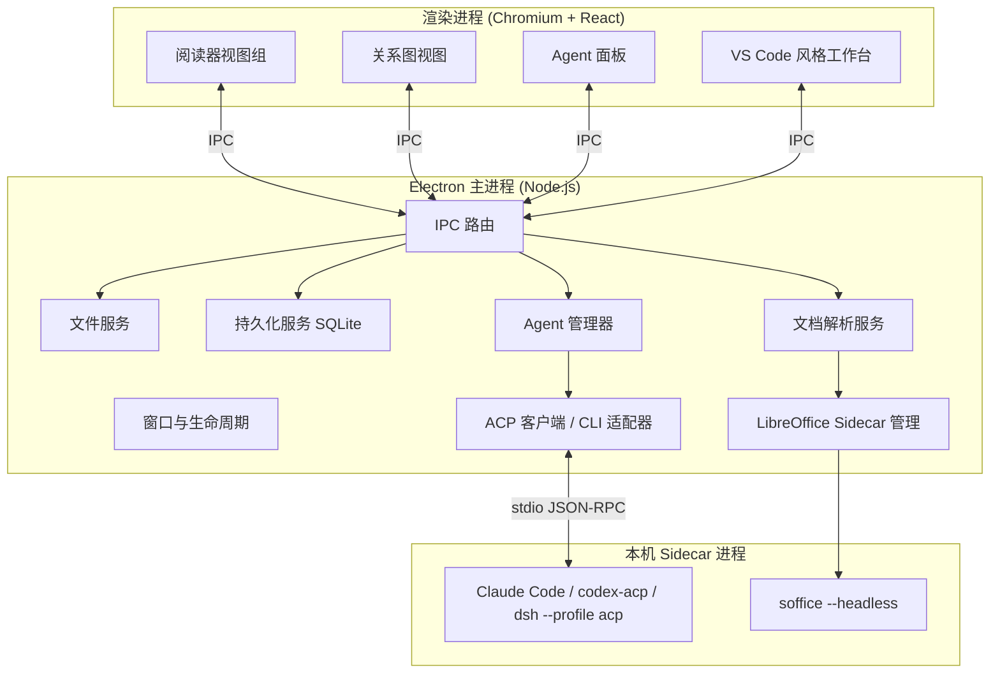

# 逻辑阅读器 LogicReader · 任务规划书

| 项目 | 内容 |
| --- | --- |
| 产品名称 | 逻辑阅读器 / LogicReader |
| 文档版本 | v1.3 |
| 文档状态 | 规划稿（评审中）——**本规划书完成后不执行** |
| 上游依据 | `预启动计划书.md`（同目录） |
| 编制方式 | 依据上游需求，经联网补充技术资料、并向用户确认 7 项关键决策后编制 |
| 交付目标 | 一个可本地运行、以 `.exe` 形式分发的 Windows 桌面阅读器 |

---

## 0. 阅读指南

本文档分三层，可按需阅读：

1. **决策层**（第 1、2 章）：产品做什么、为谁做、需求边界在哪。
2. **设计层**（第 3–7 章）：怎么做，含架构、选型、核心机制、数据结构、界面规格。
3. **执行层**（第 8–13 章）：怎么打包、怎么排期、怎么验收、有什么风险。

本文档只做规划。文末第 14 章列出待用户在开工前最终确认的剩余问题。

---

## 1. 产品概述

### 1.1 一句话定义

**LogicReader 是一个"会画逻辑图"的本地文档阅读器**：它把 PDF / Markdown / Word / PPT / Excel 变成可深读的对象，调用本机已安装的 AI Agent（Claude Code、Codex、DeepSeek Harness 等）通读全文，产出一张**可交互、可跳转、可追问**的逻辑关系图，并让用户的每一次局部提问都沉淀回这张图上。

### 1.2 解决的问题

传统阅读器（Adobe Reader、SumatraPDF、Typora、WPS）解决的是"**把字显示出来**"，但没有解决"**把逻辑读出来**"：

- 读长文档时，读者在细节里迷路，看不清全文论证骨架；
- 看不懂的地方想提问，必须手动复制一大段上下文、切到另一个 AI 窗口、自己描述"这段在文中什么位置"；
- AI 的回答读完就散，无法回填到原文对应位置；
- 不同 Agent 工具各自为政，用户被迫在多个客户端之间搬运文本。

LogicReader 把这三件事合成一个闭环：**读 → 问 → 图 → 回到原文**。

### 1.3 目标用户

| 用户画像 | 典型场景 | 最在意的点 |
| --- | --- | --- |
| 研究者 / 研究生 | 读 100+ 页论文、综述，需要快速抓论证链 | 关系图质量、跳转准确度 |
| 工程师 | 读技术白皮书、RFC、规范文档 | 与 Claude Code / Codex 的联动、代码片段提问 |
| 分析师 / 咨询 | 读行业报告、财报、标书 | PDF 阅读体验、标注导出、黑底白字长时间阅读 |
| 法务 / 合规 | 读合同、条款，需要逐条比对 | 定位精确、引用可回溯 |
| 重度 AI 用户 | 已在本机装好多种 Agent CLI | 统一入口、会话不丢、成本可控 |

### 1.4 核心价值主张

1. **逻辑可视**：不是生成一张图片，而是一张活的、有标注、可点击的图。
2. **位置即上下文**：用户选中任何文字，位置信息自动注入提示词，AI 永远知道"你在说哪一段"。
3. **Agent 中立**：通过开放协议接入，不绑定任何一家模型厂商。
4. **全本地**：文档不出本机；只有用户主动发起的 Agent 调用才会外发内容。

### 1.5 设计原则

| 原则 | 含义 | 具体约束 |
| --- | --- | --- |
| 阅读优先 | 阅读器体验不能为 AI 功能让路 | 无网络、未配置 Agent 时，产品必须是一个完整好用的阅读器 |
| 图是索引不是装饰 | 每个节点、每条边都必须能指回原文 | 无法建立锚点的抽取结果一律丢弃 |
| 上下文可控 | 用户始终知道"这次提问带了什么上下文" | Agent 面板必须可视化本次请求的上下文组成，并允许手动增删 |
| 渐进增强 | 缺依赖时降级而非崩溃 | 没装 LibreOffice 就不能开 `.doc`，但 PDF 阅读不受影响 |
| 键盘可达 | 重度用户不该被迫用鼠标 | 核心操作全部有快捷键（见 6.6） |

### 1.6 名词表

| 术语 | 含义 |
| --- | --- |
| **文档块（Block）** | 统一文档模型的最小逻辑单元：PDF 的一个段落、Markdown 的一个段落/标题/代码块、Word 的一个段落、Excel 的一个单元格区域、PPT 的一个形状 |
| **锚点（Anchor）** | 指向原文一段连续文字的结构化定位信息，是"跳转"和"高亮"的唯一凭据 |
| **关系图（Logic Graph）** | 由节点与带类型的有向边构成的逻辑结构图 |
| **节点（Node）** | 一个从原文抽取的概念、论点、结论、证据或用户提问 |
| **边（Edge）** | 节点之间的逻辑关系，带类型标签与原文依据 |
| **ACP** | Agent Client Protocol，编辑器与 AI Agent 之间的开放通信协议 |
| **上下文模式** | 决定"这次提问把哪些内容交给 Agent"的策略，本产品有两种 |
| **Sidecar** | 随主程序分发的辅助进程（如 LibreOffice 转换服务） |

---

## 2. 需求规格

### 2.1 原始需求追溯表

| 编号 | 原始需求（摘自预启动计划书） | 落地章节 |
| --- | --- | --- |
| R-01 | 具有查看本地文件的能力，可阅读查看 PDF、markdown、word 图文文件格式 | FR-1 / 5.2 |
| R-02 | 可以接入 Claude Code、Codex、DeepSeek Harness 等 Agent 工具 | FR-2 / 5.4 |
| R-03 | 基础界面要求 UI 仿照 VS Code，调用 Agent 工具的方式也与其保持一致 | FR-3 / 第 6 章 |
| R-04 | 打开文件后界面 UI 为常规 PDF 阅读器 UI（放大缩小、标记、目录跳转等） | FR-4 / 6.2 |
| R-05 | 产品要求能够本地运行，以 `.exe` 程序的方式呈现最终效果 | FR-5 / 第 8 章 |
| R-06 | 文件支持黑色和白色模式，特别是 PDF 要求能以黑底白字形式呈现 | FR-6 / 5.3 |
| R-07 | 请求用户询问是否激活 Agent 将打开的文件通读，生成可交互关系图 | FR-7.1 / 5.5 |
| R-08 | 关系图不是 .jpg/.png 图片，每个节点和连线都有具体标注 | FR-7.2 |
| R-09 | 默认以二维方式呈现，用户可作其他要求 | FR-7.3 |
| R-10 | 关系图简约美观、可读性强 | FR-7.4 |
| R-11 | 选择节点或连线时自动跳转到对应段落并高亮 | FR-7.5 / 5.1 |
| R-12 | 若不是一段，则给出具体位置让用户选择 | FR-7.6 |
| R-13 | 用户选中段落/文本时自动添加提示词指出该段在文本中的位置，并将该文本作为提示词交付 | FR-8.1 / 5.6 |
| R-14 | 用户在阅读过程中的提问同样加入关系图中 | FR-8.2 |
| R-15 | Agent 两种激活模式：全文本模式 / 每次重新激活（以关系图及其下对话为上下文） | FR-9 / 5.7 |
| R-16 | 完成计划书后不执行计划书 | 本文档仅规划，不含执行动作 |
| R-17 | **（本轮新增）** 要求关闭后再次打开，能恢复上一次关闭时的全部内容和界面 | FR-10 / 5.9 |

### 2.2 FR-1 本地文件查看与阅读

**优先级：P0**

| 子项 | 要求 |
| --- | --- |
| FR-1.1 | 支持通过菜单、快捷键、拖拽、命令行参数打开本地文件 |
| FR-1.2 | 支持 PDF：文本层、图片、矢量图形、多栏排版、书签目录、超链接 |
| FR-1.3 | 支持 Markdown（`.md` / `.markdown`）：GFM 表格、任务列表、代码块高亮、LaTeX 公式、脚注、图片 |
| FR-1.4 | 支持 Word `.docx`：段落、样式、表格、图片、页眉页脚（尽力）、分页近似 |
| FR-1.5 | 支持旧版 `.doc`（经 LibreOffice 转换后阅读）——**用户已确认需要** |
| FR-1.6 | 支持 `.xlsx` / `.xls`：原生表格视图（多 Sheet、冻结窗格、公式值） |
| FR-1.7 | 支持 `.pptx` / `.ppt`：经 LibreOffice 转 PDF 后按页阅读——**用户已确认需要** |
| FR-1.8 | 支持纯文本 `.txt`、`.csv` 作为附属能力 |
| FR-1.9 | 多标签页：同时打开多个文档，VS Code 风格的标签栏与分屏 |
| FR-1.10 | 文件变更监听：磁盘上的文件被外部修改时提示重新加载 |
| FR-1.11 | 最近打开列表；完整的会话与界面恢复见 **FR-10 / §5.9** |

**边界（不做）**：加密/受密码保护的 PDF 首版仅提示不支持；扫描版 PDF 的 OCR 列为二期。

### 2.3 FR-2 Agent 接入

**优先级：P0**

| 子项 | 要求 |
| --- | --- |
| FR-2.1 | 支持接入 Claude Code（Anthropic） |
| FR-2.2 | 支持接入 Codex（OpenAI Codex CLI） |
| FR-2.3 | 支持接入 DeepSeek Harness（`dsh`） |
| FR-2.4 | 支持接入 Gemini CLI 等其它兼容 ACP 的 Agent（架构上开放，不写死三家） |
| FR-2.5 | 支持用户手动添加自定义 Agent（可执行文件路径 + 启动参数 + 协议类型） |
| FR-2.6 | Agent 管理器：自动探测本机已安装的 Agent、显示版本与可用性、启停、设为默认 |
| FR-2.7 | 同一文档可切换 Agent；不同会话可并行使用不同 Agent |
| FR-2.8 | 流式输出：回复逐字/逐块渲染，工具调用过程可见（可折叠） |
| FR-2.9 | 权限请求：Agent 请求文件读写或执行命令时，弹出与 VS Code 风格一致的确认框 |
| FR-2.10 | 中断：可随时停止正在进行的 Agent 运行 |
| FR-2.11 | 密钥管理：API Key 使用 Electron `safeStorage` 加密存储，不落明文 |

### 2.4 FR-3 VS Code 风格界面

**优先级：P0**

| 子项 | 要求 |
| --- | --- |
| FR-3.1 | 采用 VS Code 的五区布局：活动栏、侧边栏、编辑区、辅助侧边栏、面板、状态栏 |
| FR-3.2 | 采用 VS Code 的配色令牌命名体系（`--vscode-*` 变量），深浅主题可整体替换 |
| FR-3.3 | 侧边栏用"视图容器 + 视图"结构：资源管理器、大纲、关系图、Agent、标注、搜索 |
| FR-3.4 | 命令面板（`Ctrl+Shift+P`）：所有功能可被搜索调用 |
| FR-3.5 | 面板（Panel）承载终端式 Agent 交互、问题列表、日志输出 |
| FR-3.6 | 状态栏显示：当前文档、页码、缩放、主题、当前 Agent、上下文 token 估算 |
| FR-3.7 | 快捷键体系与 VS Code 保持一致（`Ctrl+P`、`Ctrl+B`、`Ctrl+J`、`Ctrl+\` 等） |
| FR-3.8 | 可拖拽的分割条、可折叠区域、可全屏的面板，与 VS Code 手感一致 |
| FR-3.9 | 界面语言中英双语，可切换（**用户已确认**） |

### 2.5 FR-4 阅读器 UI

**优先级：P0**（针对 PDF）

| 子项 | 要求 |
| --- | --- |
| FR-4.1 | 工具栏：打开、翻页、页码输入、缩放（放大/缩小/适应宽度/适应页面/实际大小）、旋转、单页/连续/双页、全屏 |
| FR-4.2 | 侧边栏缩略图，与主视图双向联动 |
| FR-4.3 | 目录（书签）树，带层级缩进，点击跳转 |
| FR-4.4 | 文本选择、复制、全选、查找（`Ctrl+F` 高亮全部命中并可在命中间跳转） |
| FR-4.5 | 标注：高亮（多色）、下划线、删除线、便签、矩形/箭头、自由涂鸦 |
| FR-4.6 | 标注列表：按页/按颜色/按类型筛选，点击跳转 |
| FR-4.7 | **导出标注到 PDF 新副本**（用 pdf-lib 写入，原文件不动）——**用户已确认** |
| FR-4.8 | 阅读进度记忆、书签、跳转历史（前进/后退） |
| FR-4.9 | 演示/专注模式：隐藏全部 AI 相关 UI |
| FR-4.10 | 文档内超链接、内部交叉引用可用 |

### 2.6 FR-5 本地运行与 .exe 分发

**优先级：P0**

| 子项 | 要求 |
| --- | --- |
| FR-5.1 | 纯本地运行，无需自建服务器 |
| FR-5.2 | 产出 Windows x64 安装包（NSIS）与免安装单文件版（portable） |
| FR-5.3 | 可选：完整版安装包内置 LibreOffice sidecar；精简版引导用户指定已有 LibreOffice 或按需下载 |
| FR-5.4 | 卸载干净：清理注册表项、快捷方式；用户数据默认保留并提示 |
| FR-5.5 | 自动更新（二期）：基于 electron-updater 的增量更新 |

### 2.7 FR-6 主题与黑底白字

**优先级：P0**

| 子项 | 要求 |
| --- | --- |
| FR-6.1 | 浅色 / 深色 / 跟随系统 三种主题模式，切换即时生效 |
| FR-6.2 | 阅读区独立主题：即使 App 是浅色，也可单独把文档设为深色 |
| FR-6.3 | PDF 黑底白字：提供三档——关闭 / 全局反色 / 智能暗色（保留图片与彩色图表） |
| FR-6.4 | 反色不破坏文本层：反色后仍可选中、复制、查找、标注 |
| FR-6.5 | Markdown / Word / Excel 主题化：由 CSS 变量驱动，随主题切换 |
| FR-6.6 | 平滑过渡：主题切换无闪烁，PDF 无需重新解析 |

### 2.8 FR-7 关系图

**优先级：P0**（本产品的核心差异点）

| 子项 | 要求 |
| --- | --- |
| FR-7.1 | 打开文档后，以非侵入方式询问用户"是否通读全文并生成逻辑关系图"，说明预计耗时与 token 消耗 |
| FR-7.2 | 生成的是**可交互的矢量结构图**，不是位图；节点与连线均带文字标注 |
| FR-7.3 | 默认二维呈现；支持用户提出其它排布要求（如"改成从左到右的流程"、"按章节分组"、"只保留因果边"） |
| FR-7.4 | 视觉风格简约：克制的配色、清晰的层级、足够的留白；节点文字可读 |
| FR-7.5 | 选中节点或连线 → 自动跳转到对应段落并高亮 |
| FR-7.6 | 若对应内容不止一段 → 弹出位置选择器，列出每一处位置（页码/标题 + 摘要）供用户选择 |
| FR-7.7 | 支持 200+ 节点规模（**用户已确认**），并提供聚合视图 |
| FR-7.8 | 支持缩放、平移、小地图、自动适应、节点搜索、按类型过滤 |
| FR-7.9 | 支持人工编辑：重命名节点、改边类型、删边、拖动布局 |
| FR-7.10 | 支持导出：JSON（可再导入）、Markdown 大纲、SVG/PNG（导出用，非存储格式） |
| FR-7.11 | 支持 200+ 节点规模，并提供聚合视图（**用户已确认**） |
| FR-7.12 | **生成精度由用户掌握**：生成前可选择精度档位并看到预估节点数 / token / 耗时 / 费用；生成后提供质量报告，可增量提高精度或合并降低精度 |
| FR-7.13 | 任何精度的重生成都必须保留用户已有的人工编辑（重命名、改边类型、删边、手动坐标） |
| FR-7.14 | **无锚点不入图**：无论精度档位高低，没有原文出处（锚点）的节点与连线一律丢弃 |
| FR-7.15 | **生成前必须由用户指定 Agent 工具**：从已探测可用的 Agent 中选择，不允许静默使用默认值 |
| FR-7.16 | **由用户决定模型**：模型列表来自 Agent 自身声明的能力（ACP 配置项），支持手填模型 ID |
| FR-7.17 | **由用户决定思考强度**：档位随所选模型联动；模型不支持时置灰并说明原因 |
| FR-7.18 | Agent / 模型 / 思考强度的任何变化都实时刷新成本预估（节点数、token、耗时、费用） |
| FR-7.19 | 生成配置可保存为命名预设；图谱记录生成时所用的 Agent / 模型 / 思考强度，支持"用相同配置重新生成" |

### 2.9 FR-8 局部提问与提问入图

**优先级：P0**

| 子项 | 要求 |
| --- | --- |
| FR-8.1 | 在阅读区选中文本时，浮动工具条出现，并且交付给 Agent 的提示词**自动包含该选区在文档中的位置描述** |
| FR-8.2 | 用户的提问作为新节点加入关系图，并与被提问的来源节点连边 |
| FR-8.3 | 提问节点可展开查看完整对话，可继续追问 |
| FR-8.4 | 会话中若 Agent 引用了文档其它位置，回复内出现可点击的定位链接 |
| FR-8.5 | 上下文可见：发送前可预览本次请求携带的上下文构成 |

### 2.10 FR-9 两种 Agent 激活模式

**优先级：P0**

| 模式 | 名称 | 上下文构成 | 用户已确认 |
| --- | --- | --- | --- |
| 模式 A | **全文本模式**（持续会话） | 文档全文（或按需检索注入）+ 会话全部历史 | ✔ |
| 模式 B | **图谱模式**（每次重新激活） | 关系图（可裁剪到相关子图）+ 该节点下属的用户与 Agent 对话 | ✔ |

| 子项 | 要求 |
| --- | --- |
| FR-9.1 | 用户可在会话开始前或进行中切换模式，切换时明确提示对上下文的影响 |
| FR-9.2 | 模式 A 需具备上下文压缩能力（滚动摘要 + 关键结论固化），避免超出模型窗口 |
| FR-9.3 | 模式 B 每次请求都是全新会话，保证上下文可控、可复现 |
| FR-9.4 | 两种模式共享同一份关系图与标注数据 |

### 2.11 FR-10 关闭与恢复

**优先级：P0**（本轮新增需求）

| 子项 | 要求 |
| --- | --- |
| FR-10.1 | **关闭应用后再次打开，恢复上一次关闭时的全部内容与界面状态** |
| FR-10.2 | 窗口：位置、大小、最大化 / 全屏、所在显示器 |
| FR-10.3 | 布局：侧边栏 / 辅助侧边栏 / 面板的显隐与尺寸、活动视图、面板标签顺序 |
| FR-10.4 | 编辑区：全部分屏结构与标签页、标签顺序、活动标签 |
| FR-10.5 | 阅读位置：页码 / 滚动位置 / 缩放 / 视图模式 / 旋转 / 阅读区主题覆盖 / PDF 灰阶档位 |
| FR-10.6 | 阅读器侧栏：分区选择、目录展开状态、活动标注 |
| FR-10.7 | 关系图：视口、布局模式、折叠的聚合节点、过滤条件、选中节点、节点人工坐标 |
| FR-10.8 | Agent：每个文档的活动会话、上下文模式、所选 Agent / 模型 / 思考强度、**输入框未发送的草稿**、消息滚动位置 |
| FR-10.9 | 异常退出（崩溃）后恢复到最近一次快照，并明确告知用户 |
| FR-10.10 | 文件缺失 / 移动 / 被外部修改 / 暂时离线时的降级处理，**不静默丢弃标签** |
| FR-10.11 | 可配置：启动时恢复上次会话（默认）/ 打开空白欢迎页 / 打开指定文件 |
| FR-10.12 | 明确列出不恢复的易失状态，避免用户产生错误预期 |
| FR-10.13 | 恢复不得阻塞启动：界面骨架 ≤ 300ms，完全一致 ≤ 2.5s |

### 2.12 本轮用户确认记录

在编制本规划书前，已就以下 7 项向用户确认，结论如下：

| # | 问题 | 用户选择 |
| --- | --- | --- |
| 1 | 桌面框架与打包方式 | **Electron + electron-builder** |
| 2 | Agent 接入方式 | **ACP 协议优先 + 各家 CLI 适配兜底** |
| 3 | 关系图规模与呈现 | **大图 200+ 节点 + 聚合视图** |
| 4 | Word / Office 支持范围 | **`.docx` + `.doc` + PPT/Excel 等更多格式** |
| 5 | 标注行为 | **支持导出为新的 PDF 副本**（不改原文件） |
| 6 | 界面语言 | **中英双语，可切换** |
| 7 | 产品名称 | **逻辑阅读器 / LogicReader** |
| 8 | 关系图节点规模 | **支持 200+ 节点**（重申确认） |
| 9 | 关系图精度 | **生成时交由用户把控**：既可选抽取粒度档位，也以"无锚点不入图"为硬门槛；生成前选档、生成后复核 |
| 10 | 生成时的 Agent / 模型 / 思考强度 | **由用户指定**：生成关系图前必须选择 Agent 工具，并由用户决定模型与思考强度 |
| 11 | 关闭后再次打开 | **恢复上一次关闭时的全部内容与界面**（见 FR-10 / §5.9） |

---

## 3. 总体架构

### 3.1 进程模型



**设计要点**

- **重活在主进程**：文件 IO、解析、SQLite、子进程管理都在主进程，渲染进程只做渲染与交互，避免 Node 集成带来的安全面。
- **渲染进程沙箱化**：`contextIsolation: true`、`nodeIntegration: false`、`sandbox: true`，全部能力经 `preload` 暴露的白名单 API。
- **PDF 渲染在渲染进程**：pdf.js 跑在 Web Worker 里，避免阻塞 UI；主进程只负责提供字节流。
- **Agent 通信**：每个 Agent 会话是一条独立的 stdio JSON-RPC 连接，由主进程托管，渲染进程通过 IPC 订阅事件流。

### 3.2 模块划分

| 模块 | 职责 | 关键接口 |
| --- | --- | --- |
| `core/document` | 统一文档模型、块序列、纯文本索引 | `DocumentModel` |
| `core/anchor` | 锚点的创建、序列化、重定位 | `AnchorService` |
| `core/parser/*` | 各格式解析器（pdf/md/docx/xlsx/lo） | `Parser` |
| `core/graph` | 关系图抽取、校验、合并、聚合、布局 | `GraphService` |
| `core/agent` | Agent 注册表、适配器、会话生命周期 | `AgentRuntime` |
| `core/agent/acp` | ACP 客户端实现 | `AcpAdapter` |
| `core/agent/cli` | CLI 直连兜底适配器 | `CliAdapter` |
| `core/context` | 上下文构建策略（模式 A / 模式 B） | `ContextBuilder` |
| `core/store` | SQLite 访问层、迁移 | `Store` |
| `core/convert` | LibreOffice sidecar 调用与缓存 | `ConvertService` |
| `ui/workbench` | 布局、视图容器、命令面板 | — |
| `ui/reader/*` | 各格式阅读器视图 | — |
| `ui/graph` | 关系图画布与交互 | — |
| `ui/agent` | 对话流、工具调用卡片、权限弹窗 | — |

### 3.3 关键数据流

**流程 1：打开文档**

```text
用户选择文件
  → 主进程读取字节流 + 计算 SHA-256
  → 按扩展名选择解析器
  → 解析器产出 DocumentModel（块序列 + 纯文本 + 偏移表 + 目录树）
  → 写入 SQLite（documents / blocks）
  → 渲染进程按格式选择阅读器视图，用 DocumentModel 渲染
```

**流程 2：生成关系图**

```text
用户确认"通读全文"
  → GraphService 取 DocumentModel 的块序列
  → 分块（按标题层级 + 长度切分，带重叠）
  → Map：每块调用 Agent 抽取 实体 / 关系 / 锚点（JSON Schema 约束）
  → Reduce：跨块实体消解、边权聚合、构建层级
  → Schema 校验 + 失败重试
  → 布局（ELK 分层 / 力导向）
  → 社区检测 → 聚合为超级节点
  → 持久化（graphs / graph_nodes / graph_edges）
  → 推送到渲染进程绘制
```

**流程 3：局部提问**

```text
用户在阅读区选中文本
  → AnchorService 由 DOM Range 反查 DocumentModel 得到 Anchor
  → 浮动工具条 → 用户输入问题
  → ContextBuilder 按当前模式组装上下文
  → 注入位置描述头（见 5.6）
  → AgentRuntime 发起一次 prompt
  → 流式回包渲染在 Agent 面板
  → 完成后把"提问节点"写入关系图并与来源节点连边
```

### 3.4 目录结构（规划）

```text
LogicReader/
├─ apps/
│  ├─ main/                  # Electron 主进程
│  │  └─ src/
│  │     ├─ ipc/             # IPC 路由与校验
│  │     ├─ services/        # fs / store / convert / agent / graph
│  │     └─ index.ts
│  ├─ preload/               # contextBridge 白名单 API
│  └─ renderer/              # React 前端
│     └─ src/
│        ├─ workbench/       # 布局、活动栏、侧边栏、面板、状态栏
│        ├─ views/
│        │  ├─ reader-pdf/
│        │  ├─ reader-markdown/
│        │  ├─ reader-docx/
│        │  ├─ reader-sheet/
│        │  └─ graph/
│        ├─ features/        # annotation / search / agent-chat / settings
│        ├─ theme/           # VS Code 风格设计令牌
│        └─ i18n/            # zh-CN / en-US
├─ packages/
│  ├─ shared/                # 跨进程共享类型与常量
│  ├─ document-model/        # DocumentModel / Anchor 定义与工具
│  └─ graph-schema/          # 关系图 JSON Schema 与校验
├─ resources/
│  ├─ icons/
│  ├─ themes/                # 主题 JSON
│  └─ libreoffice/           # 完整版内置（可选）
├─ scripts/                  # 构建、打包、sidecar 准备
└─ electron-builder.yml
```

---

## 4. 技术选型

### 4.1 选型总表

| 领域 | 选型 | 备选 | 决策依据 |
| --- | --- | --- | --- |
| 桌面框架 | **Electron + electron-builder** | Tauri 2 | 用户已确认。本产品重度依赖 Node 生态（子进程、PTY、PDF 解析、SQLite），且需内置 LibreOffice sidecar，Electron 集成成本最低 |
| 前端框架 | **React 18 + TypeScript** | Vue 3 / Solid | 关系图与 VS Code 风格组件生态（React Flow、Monaco）以 React 为主 |
| 构建 | **Vite + electron-vite** | Webpack | 冷启动与 HMR 体验好，配置量小 |
| PDF 渲染 | **pdfjs-dist（PDF.js）** | pdfium、mupdf | Mozilla 维护、文本层成熟、支持目录/标注/查找；纯 JS 便于随 Electron 打包 |
| PDF 写回 | **pdf-lib** | — | 纯 JS，可在无原生依赖下把高亮/批注写入新副本 |
| Markdown | **react-markdown + remark-gfm + rehype-katex + Shiki** | markdown-it | remark 生态 AST 完整，便于生成块偏移与锚点 |
| DOCX 渲染 | **docx-preview** | mammoth.js | 保留原始排版与样式；mammoth 语义化输出适合做块切分，二者可并用 |
| 旧格式转换 | **LibreOffice headless sidecar** | 纯 JS 方案 | `.doc` / `.ppt` 前端无法解析；LO 转 PDF 是唯一稳妥路径。业界已有同类产品内置完整 LibreOffice 副本的先例 |
| 表格 | **SheetJS + 虚拟滚动表格** | 转 PDF 后阅读 | 原生表格保留多 Sheet 与公式，阅读体验显著优于分页 PDF |
| 代码编辑/查看 | **Monaco Editor** | CodeMirror 6 | 与 VS Code 同源，视觉与手感一致 |
| 布局/停靠 | **自研 Flex 布局 + react-resizable-panels** | FlexLayout、Golden Layout | VS Code 布局规则简单明确，自研可控性更高、依赖更轻 |
| 关系图渲染 | **React Flow v12（@xyflow/react）** | Cytoscape.js、AntV G6、sigma.js | 自定义节点/边能力最强、与 React 一致；支持 parentId 子流（聚合折叠）、EdgeLabelRenderer（连线标注） |
| 图布局 | **ELK.js（分层）+ d3-force（力导向）** | dagre | ELK 对分层与分组约束支持更好；dagre 作为轻量备选 |
| 图算法 | **graphology + Louvain** | 自研 | 社区检测用于大图聚合与配色 |
| Agent 协议 | **ACP（@agentclientprotocol/sdk）** | 各家 CLI 私有参数 | 用户已确认。统一会话/流式/工具调用/权限模型，新增 Agent 只需注册 |
| Agent 兜底 | **CLI 适配器**（claude -p / codex exec / dsh headless） | — | 对尚未提供 ACP 端点或需要特殊参数的场景 |
| 存储 | **better-sqlite3** | SQLite WASM、lowdb | 同步 API 简单可靠，适合主进程；支持全文检索扩展 |
| 状态管理 | **Zustand + Immer** | Redux Toolkit | 轻量，适合中等规模状态 |
| 国际化 | **i18next + react-i18next** | 自研 | 中英双语，用户已确认 |
| 测试 | **Vitest + Playwright** | Jest | Vitest 与 Vite 同源；Playwright 驱动 Electron 做端到端 |

### 4.2 为什么是 Electron（而不是 Tauri）

| 维度 | Electron | Tauri 2 | 对本产品的意义 |
| --- | --- | --- | --- |
| 安装包体积 | 约 150–250 MB | 约 10–30 MB | 本产品还要内置 LibreOffice（约 350 MB），Tauri 的体积优势被稀释 |
| 内存占用 | 较高 | 较低 | 阅读器属于单窗口长时间运行场景，可接受 |
| 子进程 / PTY | Node `child_process` 直接可用 | 需写 Rust 侧代码 | **决定性因素**：需要频繁 spawn Agent CLI 并做 stdio JSON-RPC 双向通信 |
| 生态库 | PDF.js / docx-preview / Monaco / React Flow 全部可直接用 | 同样可用（WebView 内） | 持平 |
| WebView 一致性 | 自带 Chromium，渲染行为一致 | 依赖系统 WebView2 | PDF 与复杂 Word 排版更需要一致的内核 |
| 跨平台 | 三平台 | 三平台 | 首期只发 Windows，均满足 |

**结论**：体积不是本产品的关键约束，进程集成能力才是。选 Electron。

### 4.3 文档渲染路线（分级策略）

| 格式 | 首选方案 | 保真度 | 依赖 |
| --- | --- | --- | --- |
| PDF | PDF.js 原生渲染 | 高（原生） | 无 |
| Markdown | remark AST → React 渲染 | 高（结构化） | 无 |
| DOCX | docx-preview 渲染；复杂排版可切换 LibreOffice→PDF | 中 / 高 | 可选 LO |
| DOC（97-2003） | LibreOffice → PDF | 高 | **必须 LO** |
| XLSX / XLS | SheetJS 原生表格视图 | 高（数据） | 无 |
| PPTX / PPT | LibreOffice → PDF | 高（版面） | **必须 LO** |

**降级策略**：未安装 LibreOffice 时，`.doc` / `.ppt` 显示友好的引导页（提供"下载完整版"或"指定本机 soffice.exe 路径"两个按钮），不影响其它格式。

### 4.4 关系图技术要点

- **渲染**：React Flow v12，节点/边全部自定义组件，以便绘制图标、类型色条、折叠按钮与常显标签。
- **连线标注**：使用 `EdgeLabelRenderer` 渲染边标签，避免 SVG 文本随缩放变形。
- **聚合**：利用 React Flow 的父子节点（sub flow）能力实现"超级节点 → 展开子节点"。
- **聚类**：graphology 构建图对象，Louvain 做社区检测，得到默认聚合分组。
- **布局**：布局计算放入 Web Worker（ELK.js 支持），避免大图布局阻塞主线程。
- **性能**：视口裁剪（只渲染可见节点）、低缩放级别降级为简化渲染、节点文本在低缩放时截断。

### 4.5 Agent 接入要点

**首选 ACP**。ACP 是编辑器与 Agent 之间的开放协议，本产品作为 **Client**，各 Agent 作为 **Agent** 端。已确认的可用端点：

| Agent | ACP 端点 | 备注 |
| --- | --- | --- |
| Claude Code | `@zed-industries/claude-code-acp` | Zed 官方维护的适配器 |
| Codex | `codex-acp` | 社区/第三方适配器，需版本探测 |
| DeepSeek Harness | `dsh --profile acp` | **原生支持**：官方 CLI 直接以 ACP stdio 服务自动化客户端 |
| Gemini CLI | `gemini --experimental-acp` | 实验性，文档标注为 ACP 模式 |

**模型与思考强度不写死在产品里**：ACP 在会话建立时返回 `configOptions`，Agent 自行声明可调项（`model` / `thought_level` / `model_config` / `mode`）。本产品把这些配置项直接渲染成 UI 下拉，因此新增 Agent、模型换代都不需要改代码。详见 5.5.3.4。

**兜底 CLI 参数**（已核对官方文档）：

| Agent | 非交互调用 | 结构化输出 | 会话延续 |
| --- | --- | --- | --- |
| Claude Code | `claude -p "<prompt>"` | `--output-format stream-json` | `--continue` / `--resume <id>`；`--bare` 可跳过环境自动发现 |
| Codex | `codex exec "<prompt>"` | `--json`（JSONL）、`--output-schema <file>`、`-o <file>` | `codex exec resume`（早期版本缺失，需能力探测） |
| DeepSeek Harness | `dsh --profile headless "<job>"` | 打印最终答案后退出 | 持久化会话；`dsh --profile sdk` 提供 JSON-RPC stdio |

**能力探测**：启动时对每个已配置 Agent 做一次能力探测（可执行文件是否存在、版本号、是否支持 ACP、是否支持 resume），结果写入设置并显示在 Agent 管理器中。UI 只暴露探测到可用的能力。

### 4.6 存储选型

- **SQLite（better-sqlite3）**：结构化数据（文档、块、锚点、图、会话、消息、标注）。
- **文件系统**：大对象（原始文件引用、转换后的 PDF 缓存、导出产物）放在 `userData/cache` 下，按内容哈希命名。
- **设置**：`electron-store` 风格 JSON + `safeStorage` 加密的密钥区。

---

## 5. 核心机制设计

### 5.1 统一文档模型与锚点系统

这是整个产品的**地基**。关系图跳转、选区提问、标注、引用回链，全部依赖它。

**统一块模型**

```ts
type BlockKind =
  | 'heading' | 'paragraph' | 'list-item' | 'code' | 'table'
  | 'image' | 'quote' | 'formula' | 'page-break' | 'cell' | 'shape';

interface Block {
  id: string;              // block_<docId>_<seq>
  docId: string;
  seq: number;             // 文档内顺序
  kind: BlockKind;
  level?: number;          // heading 层级
  text: string;            // 归一化纯文本
  charStart: number;       // 在整篇归一化文本中的全局偏移
  charEnd: number;
  locator: Locator;        // 格式特有定位
  parentId?: string;       // 层级父块（用于目录树）
}
```

**格式特有定位符**

```ts
type Locator =
  | { kind: 'pdf';    page: number; rects: Rect[] }        // rects 为归一化坐标 0..1
  | { kind: 'text';   line: number; column: number }        // markdown / txt
  | { kind: 'docx';   paraIndex: number; runRange?: [number, number] }
  | { kind: 'sheet';  sheet: string; range: string }        // 如 Sheet1!B4:D9
  | { kind: 'slide';  slide: number; shapeId?: string };
```

**锚点（Anchor）**

```ts
interface Anchor {
  id: string;
  docId: string;
  docHash: string;          // sha256，用于判断文档是否被改过
  blockIds: string[];       // 覆盖的块（可能连续多个）
  charStart: number;        // 全局字符偏移
  charEnd: number;
  quote: string;            // 原文片段，用于模糊重定位
  quoteHash: string;        // 归一化后的哈希
  primary: Locator;         // 主定位（跳转首选）
  extras: Locator[];        // 同一锚点跨页/跨块时的其余定位
}
```

**重定位规则（文档被外部修改时）**

1. `docHash` 相同 → 直接命中，无需重定位。
2. `docHash` 不同 → 用 `quoteHash` 在归一化文本里精确查找。
3. 精确查找失败 → 用归一化 + 编辑距离做模糊匹配（阈值 0.85），命中则更新锚点。
4. 全部失败 → 锚点标记为 `stale`，在 UI 中以灰色显示并提示"原文已变更，无法定位"。

**归一化规则**（影响所有偏移的稳定性）：统一换行符；折叠连续空白；不改变大小写；保留标点；中文不做分词处理。

### 5.2 文档解析与渲染管线

**PDF 管线**

1. 用 `pdfjs-dist` 在 Web Worker 中加载，读取 `numPages`、`getOutline()`（目录）、`getMetadata()`。
2. 逐页 `getTextContent()` → 按行合并为段落候选（依据 y 坐标间距与缩进启发式）→ 生成块序列与全局偏移表。
3. 渲染：`page.render()` 画到 canvas；`page.getTextContent()` 生成透明文本层 DOM，每个 span 带 `data-char-start` / `data-char-end` / `data-block-id`。
4. 选区 → 锚点：由 DOM Range 取起止 span 的字符偏移，夹取到块边界；由 range 的矩形集合（`getClientRects()`）换算为归一化 rects。
5. 目录跳转：`outline` 项的 `dest` → `getDestination()` → `getPageIndex()` + `getViewport()` 换算坐标。

**Markdown 管线**

1. `remark-parse` → mdast → 遍历生成块序列，每块的 `position` 提供源码行/列偏移，转换为全局字符偏移。
2. 渲染 `react-markdown`，为每个块容器注入 `data-block-id`。
3. 代码块用 Shiki 高亮（构建期预加载常用语言）；公式用 KaTeX。

**DOCX 管线**

1. 用 `docx-preview` 渲染到容器，保留样式与内嵌图片。
2. 同时用轻量 OOXML 解析（`jszip` + `fast-xml-parser` 读 `word/document.xml`）得到 `w:p` 段落序列与文本，建立 `paraIndex` ↔ DOM 节点映射。
3. 由于 `docx-preview` 生成的 DOM 结构可预测，按顺序把 `data-block-id` 注入段落元素。
4. 若用户选择"高保真模式"，则走 LibreOffice → PDF，复用 PDF 管线（此时锚点退化为 PDF 定位）。

**LibreOffice 转换管线**

```text
输入文件 → 计算内容哈希 → 查缓存 (userData/cache/lo/<hash>.pdf)
  命中 → 直接返回
  未命中 → 以独立用户配置目录启动：
      soffice --headless --norestore --invisible
              -env:UserInstallation=file:///.../lo-profile
              --convert-to pdf --outdir <cacheDir> <input>
  等待进程退出 → 校验产物 → 返回
```

并发控制：LibreOffice 的同一 `UserInstallation` 不能并发，需串行队列 + 超时（默认 60s）+ 失败重试一次。

### 5.3 深色主题与 PDF 黑底白字

这是 R-06 的核心实现，不能简单用 CSS `filter: invert(1)`——那会把图片变成负片、把彩色图表变得不可读。

**三档模式**

| 模式 | 实现 | 适用 |
| --- | --- | --- |
| 关闭 | 原样渲染 | 彩色图表、设计稿 |
| 全局反色 | canvas 叠加 `filter: invert(1) hue-rotate(180deg)` | 纯文字文档，追求速度 |
| **智能暗色（默认）** | 像素级亮度反转 + 图像区域保护 | 绝大多数场景 |

**智能暗色算法**

1. PDF.js 渲染完成后，取 canvas 的 ImageData。
2. 通过 `page.getOperatorList()` 扫描 `paintImageXObject` / `paintJpegXObject` / `paintInlineImage` 及其变换矩阵，换算出**图像区域的屏幕矩形集合**。
3. 在 WebGL fragment shader 中逐像素处理：
   - 对非图像区域：转换到 HSL/Lab，仅令 `L' = 1 - L`，保留色相与饱和度（低饱和度像素自然得到"黑底白字"效果，彩色文字保持可辨识）。
   - 对图像区域：按用户设置处理——**保持原样**（默认，通过二次逆变换抵消）/ 轻度提亮 / 同样反转。
4. 处理结果绘制到一个覆盖 canvas，或直接由 WebGL 输出。
5. 文本层不受影响（透明 DOM），选中、复制、查找、标注全部照常工作。

**性能与缓存**

- 每页处理结果按 `(docHash, pageNumber, mode, zoomBucket)` 缓存为 `ImageBitmap`。
- 视口外的页面不处理；滚动时按需处理。
- 主题切换不触发 PDF 重新解析，只重跑 shader 与缓存查询，做到"无闪烁切换"。

**其它格式的主题化**：Markdown / DOCX / 表格全部由 CSS 变量驱动，切换 `data-theme` 属性即可，无需重新渲染。

### 5.4 Agent 适配层

**分层结构**

```text
AgentRuntime（会话生命周期、事件总线、错误重试）
   ├── AgentAdapter（抽象接口）
   │      ├── AcpAdapter      ← 首选，stdio JSON-RPC
   │      ├── CliAdapter      ← 兜底，spawn + 解析 stdout
   │      └── MockAdapter     ← 测试与演示
   └── AgentRegistry（探测、注册、能力矩阵）
```

**抽象接口**

```ts
interface AgentAdapter {
  readonly id: string;                 // 'claude-code' | 'codex' | 'dsh' | custom
  probe(): Promise<AgentCapability>;   // 是否存在、版本、支持的能力
  start(opts: SessionOptions): Promise<AgentSession>;
}

interface AgentSession {
  readonly sessionId: string;
  prompt(input: PromptInput): AsyncIterable<AgentEvent>;  // 流式事件
  cancel(): Promise<void>;
  dispose(): Promise<void>;
}

type AgentEvent =
  | { type: 'text-delta'; text: string }
  | { type: 'thinking'; text: string }
  | { type: 'tool-call'; name: string; input: unknown }
  | { type: 'tool-result'; name: string; output: unknown; isError: boolean }
  | { type: 'permission-request'; requestId: string; detail: PermissionDetail }
  | { type: 'usage'; inputTokens: number; outputTokens: number }
  | { type: 'done'; stopReason: string }
  | { type: 'error'; message: string; retryable: boolean };
```

**ACP 方法映射**（客户端侧）

| ACP 方法 | 本产品动作 |
| --- | --- |
| `initialize` | 建立连接，协商版本与能力，展示 Agent 名称/版本 |
| `authenticate` | 若 Agent 要求，弹出登录引导 |
| `session/new` | 用户新建会话时调用，携带工作目录 |
| `session/prompt` | 发送用户提问（含上下文与位置头） |
| `session/update`（通知） | 转成上面的 `AgentEvent` 推给渲染进程 |
| `session/request_permission` | 弹权限确认框，把用户选择回传 |
| `session/cancel` | 用户点"停止" |
| `fs/read_text_file` | 由本产品按锚点裁剪后返回，**只暴露文档必要片段** |
| `fs/write_text_file` | 默认拒绝；仅当用户在设置中显式开启"允许 Agent 写文件"才允许，且限于用户指定目录 |

**CLI 兜底适配器要点**

- `claude -p`：加 `--bare` 避免加载用户环境中的 hook / MCP / CLAUDE.md 造成行为不可预期；用 `--append-system-prompt` 注入文档上下文；用 `--output-format stream-json` 解析流式事件；用 `--allowedTools` 控制权限。
- `codex exec`：用 `--json` 拿 JSONL；用 `--output-schema` 直接约束关系图抽取的结构化输出；用 `-C` 指定工作目录；用 `--sandbox read-only` 收窄权限。
- `dsh --profile headless "<job>"`：一次性任务，适合"生成关系图"这类不需多轮的任务；`dsh --profile sdk` 提供 JSON-RPC stdio，可作为 ACP 之外的第二个原生通道。

**Windows 进程启动的坑（必须处理）**

| 问题 | 对策 |
| --- | --- |
| npm 全局安装的 CLI 是 `.cmd` shim，`spawn` 直接调用报 `ENOENT` | `resolveAgentExecutable()`：依次尝试 用户配置路径 → `where.exe` 查询 → 解析 `.cmd` 内容取出 `node <script>` 真实入口 → 常见安装目录；**优先用 `node <script>` 形式启动，绕开 shell** |
| 启动子进程弹出黑色控制台窗口 | `windowsHide: true`；对 `.cmd` 使用 `cmd.exe /d /s /c` 且严格转义参数，禁用 `shell: true` 的字符串拼接 |
| PATH 在打包后的 App 中不含用户级 npm 目录 | 启动时把 `%APPDATA%\npm`、`%LOCALAPPDATA%\pnpm`、Volta / nvm / fnm 的 bin 目录追加进子进程 PATH |
| 进程残留 | 应用退出时按进程树 `taskkill /T` 清理；启动时清理上次残留的 pid 记录 |
| 编码乱码 | 子进程 stdio 强制 `utf8`；Windows 上传 `chcp 65001` 或依赖 Node 的字节流解码 |

**安全约束**

- 密钥只存在于主进程内存与 `safeStorage` 密文，绝不进渲染进程、绝不写日志。
- Agent 的工作目录默认设为文档所在目录的**只读影子目录**（或空目录），避免 Agent 擅自改写用户文件。
- 默认拒绝一切 `fs/write_text_file` 与命令执行权限请求；用户可在设置中按 Agent 放行。

### 5.5 关系图机制

#### 5.5.1 激活流程（R-07）

打开文档后，在阅读区右下角呈现一条**非侵入式提示条**（不是模态弹窗）：

> 🧠 是否通读全文并生成逻辑关系图？
> Agent **Claude Code** · 模型 **Opus** · 思考强度 **高** · 精度【结构图】60–150 节点
> 预计 3–6 分钟 · 约 12 万 token
> [生成] [调整精度 ▾] [暂不] [不再提示此文档]

点击"生成"才真正开始。若用户选择"暂不"，可在侧边栏"关系图"视图中随时重新发起。

#### 5.5.2 抽取流程

```text
1. 取 DocumentModel 的块序列
2. 分块（Chunking）
   - 优先按标题层级切分，使每块语义完整
   - 单块目标 3000 tokens，上限 6000，相邻块重叠 15%
   - 记录每块的 charStart/charEnd
3. Map：对每块并发调用 Agent（并发度默认 3）
   提示词要求返回严格 JSON：
   {
     "entities": [{ "name", "type", "summary", "evidence": "原文摘句",
                    "spans": [{ "charStart", "charEnd" }] }],
     "relations": [{ "from", "to", "type", "label", "evidence",
                     "spans": [{ "charStart", "charEnd" }] }]
   }
4. 校验：JSON Schema 校验 + spans 必须落在当前块范围内
   - 失败 → 自动重试（最多 2 次，每次附带错误原因）
   - 仍失败 → 该块降级为"仅抽取实体"，并记录 warning
5. Reduce：
   - 实体消解：先按规范化名称精确合并；再用向量相似度（阈值 0.88）候选，
     交由 Agent 判定是否为同一概念
   - 边合并：同 from/to/type 的多条边合并，保留全部 spans，权重 = 出现次数
   - 层级构建：按标题层级建立 章节 → 小节 → 论点 的父子关系
6. 图后处理：
   - 丢弃孤立节点（除"结论"类型）
   - 丢弃无锚点的节点与边（对应"图是索引"原则）
   - 边类型归一化到受控词表
```

**受控词表（边类型）**

| 类型 | 含义 | 视觉 |
| --- | --- | --- |
| `causes` | 因果 | 实线箭头，暖色 |
| `supports` | 论据支持 | 实线箭头，绿色 |
| `refutes` | 反驳 / 反例 | 虚线箭头，红色 |
| `elaborates` | 展开说明 | 实线箭头，蓝色 |
| `contrasts` | 对比 / 对照 | 双向虚线，紫色 |
| `sequences` | 时间 / 步骤递进 | 实线箭头，灰蓝 |
| `defines` | 定义 | 点线箭头，青色 |
| `references` | 引用 / 参见 | 点线箭头，灰色 |
| `inquiry` | 用户提问（见 5.5.8） | 加粗虚线，强调色 |

#### 5.5.3 生成精度：由用户掌握（R-07 增强）

> 用户诉求：关系图可支持到 200+ 节点，且**生成时精度交由用户把控**。

##### 5.5.3.1 精度的两层含义

本产品的"精度"是一个**复合概念**，两层同时生效，缺一不可：

| 层次 | 含义 | 用户可否调 |
| --- | --- | --- |
| **粒度** | 抽取多细：节点多少、边保留到多细的层级 | ✅ 生成前选档位，生成后可升降 |
| **严格度** | 多准：每个节点与边是否都有原文出处并通过校验 | ❌ 不可下调，是硬门槛 |

**严格度是硬门槛**：无论用户选哪个档位，"无锚点不入图"始终成立。粗档位只是"少抽一些"，不是"抽得随便一些"。

##### 5.5.3.2 精度档位

| 档位 | 名称 | 目标节点数 | 抽取内容 | 相对成本 | 40 页论文典型耗时 |
| --- | --- | --- | --- | --- | --- |
| 1 | 骨架图 | 15–40 | 仅章节级论点与主干逻辑边，同义实体合并 | 1× | 1–2 分钟 |
| 2 | **结构图（默认）** | 60–150 | 论点 + 关键证据，保留主要关系类型 | 3× | 3–6 分钟 |
| 3 | 全景图 | 200–400+ | 论点 / 证据 / 数据 / 定义 / 方法全量抽取，保留细粒度与弱关系 | 8–12× | 8–20 分钟 |
| — | 自定义 | 用户指定 | 用户设定目标节点数、抽取范围、边类型白名单 | 按配置估算 | 按配置估算 |

档位对抽取提示词的实际影响：

| 档位 | 分块策略 | 实体类型白名单 | 边的保留阈值 |
| --- | --- | --- | --- |
| 骨架图 | 按一级标题切分，块更大（目标 6000 tokens） | 仅 claim / conclusion | 仅 causes / supports / sequences，权重 ≥ 3 |
| 结构图 | 按二三级标题切分，目标 3000 tokens | claim / conclusion / evidence / definition | 全部类型，权重 ≥ 2 |
| 全景图 | 按段落聚合切分，目标 1500 tokens，重叠 20% | 全部 8 种 | 全部类型，权重 ≥ 1（保留弱关系） |

##### 5.5.3.3 生成前的确认面板

点击"生成"后弹出的是**可调整的确认面板**，而不是直接开始：

```text
┌─ 生成逻辑关系图 ────────────────────────────────────────────┐
│ Agent [ Claude Code ▾ ]   模型 [ Opus ▾ ]   思考强度 [ 高 ▾ ]      │
│ 精度档位   ○ 骨架图   ● 结构图   ○ 全景图   ○ 自定义        │
│                                                             │
│ 预估结果   ~ 60–150 个节点 · ~ 180 条连线                   │
│ 预估成本   ~ 12 万 token · 3–6 分钟      │
│                                                             │
│ ▸ 高级选项                                                  │
│    抽取范围    ⦿ 全文   ○ 指定章节   ○ 从当前页开始         │
│    节点数上限  [ 200 ]  （超出时按边权截断）                │
│    关系类型    ☑因果 ☑支持 ☑反驳 ☑展开 ☑对比 ☑递进 …      │
│    分块大小    [ 3000 ] tokens    并发度 [ 3 ]              │
│    实体消解阈值 [ 0.88 ]                                    │
│                                                             │
│              [ 开始生成 ]   [ 取消 ]                        │
└─────────────────────────────────────────────────────────────┘
```

**关键要求**

- 面板必须在真正调用 Agent **之前**出现，且预估值需随档位切换实时更新。
- 预估值基于本机历史统计（同类文档的平均值），首次使用时给出保守区间并标注"估算"。
- 用户上次的选择应被记住并作为默认值。

##### 5.5.3.4 生成前的 Agent / 模型 / 思考强度选择

> 本轮新增需求：**生成关系图时请求用户指定 Agent 工具，并由用户决定采用哪个模型、以多高的思考强度运行。**

###### 三项选择器

| 选择项 | 数据来源 | 必填 | 默认值 |
| --- | --- | --- | --- |
| **Agent 工具** | Agent 注册表（能力探测结果），只列本机可用的 | 是 | 上次选择 / 全局默认 Agent |
| **模型** | ① ACP 配置项（`category = model`）；② Agent 声明的模型目录；③ 用户手填模型 ID | 是 | 该 Agent 的默认模型 |
| **思考强度** | ① ACP 配置项（`category = thought_level`）；② 各 Agent 原生档位映射；③ 不支持时置灰 | 否 | 中 |

三项都排在面板**最上方**，因为它们对成本与质量的影响远大于精度档位。

###### 首选实现路径：ACP Session Config Options

ACP v1 提供了通用的**会话配置项**机制：Agent 在建立会话时返回 `configOptions` 列表，由 Agent 自己声明有哪些可调项、当前值、以及每个取值的名称与描述。其 `category` 已经覆盖了本需求所需的全部三类：

| ACP category | 含义 | 本产品用途 |
| --- | --- | --- |
| `model` | 模型选择器 | **模型下拉** |
| `thought_level` | 思考 / 推理档位选择器 | **思考强度下拉** |
| `model_config` | 模型相关参数（上下文大小、速度/质量权衡） | 高级选项，与模型选择器就近呈现 |
| `mode` | 会话模式（权限模式） | 生成图时建议只读模式 |

**结论：能用 ACP 就一定用 ACP。** 模型与思考强度的可选项全部来自 Agent 自身的声明，本产品**不硬编码任何模型名**，新增 Agent 或模型换代都不需要改代码。ACP 文档明确建议客户端优先使用 `configOptions`，并指出旧的 `modes` 字段将在未来版本移除；同时要求 `model_config` 类选项与模型选择器就近渲染。

###### 兜底路径：各 Agent 原生参数映射

当 Agent 未提供 ACP 配置项时，回退到原生参数（下表为文档核实结果）：

| 本产品档位 | Claude Code | Codex | DeepSeek Harness |
| --- | --- | --- | --- |
| 关闭 | 指定模型，不额外的 effort 设置 | `model_reasoning_effort = "none"` | 不选择任何 `reasoningEffort` |
| 低 | `/effort low` 等价配置 | `"minimal"` / `"low"` | 选模型声明的最低档 |
| 中（默认） | `/effort medium` | `"medium"` | 选模型声明的中档 |
| 高 | `/effort high` | `"high"` | 选模型声明的高档 |
| 最高 | `/effort max`（仅部分模型支持）；或在提示词中含 `ultrathink` | `"xhigh"` | 选模型声明的最高档 |

**各家的关键差异（决定适配器怎么写）**

| Agent | 机制 | 实现要点 |
| --- | --- | --- |
| **Claude Code** | 模型走 `--model`（支持 `default / best / fable / sonnet / opus / haiku / opusplan` 等别名与完整模型名）；思考强度走 `/effort low\|medium\|high\|max` 或 settings 的对应字段 | effort 参数**并非所有模型都支持**，需按模型探测；`max` 支持面更窄；不支持时该档位置灰 |
| **Codex** | `model_reasoning_effort` 取值 `none / minimal / low / medium / high / xhigh`；也可写进 `[profiles.*]` 用 `codex --profile fast` 切换 | 优先级为 **CLI 标志 > profile > 全局配置**；非交互生成用 `codex exec -c model_reasoning_effort="high"`；另有 `plan_mode_reasoning_effort` 与 `model_reasoning_summary` 可作高级项 |
| **DeepSeek Harness** | 三层概念必须分清：`reasoningEfforts`（**模型条目声明**有哪些档位及其 wire 拼写）、`reasoning`（provider profile 的**部署默认**）、`reasoningEffort`（**某次请求的选择**） | headless 命令**本身不提供**思考强度标志，档位属于共享的模型路由系统。做法：① 先 `dsh --profile headless --dump-config` 读实际能力；② 为本次生成用临时 patch overlay `--patch ./gen-high.yml`（启动器标志必须在任务参数之前）指定档位；③ **选中未声明的档位会在发出网络请求前失败**（`UNSUPPORTED_REASONING_EFFORT`），必须在 UI 层提前拦住 |

> ⚠️ **不要跨适配器搬字段**：官方 DeepSeek 适配器把 `thinking: enabled` 与 `reasoningEffort: max` 分开表达，与第三方网关的 `reasoning: max` 写法不同。所有档位一律以**运行时探测**为准，上表仅作为探测失败时的回退目录。

###### 能力探测与降级

| 探测结果 | UI 行为 |
| --- | --- |
| ACP 返回 `configOptions` | 直接渲染为下拉，选项名称与描述来自 Agent，本产品不改写 |
| 只拿到模型列表，没有 `thought_level` | 思考强度置灰，提示"该 Agent / 模型不支持调节思考强度" |
| Claude Code 模型不支持 effort | 同上，并在档位旁标注支持的模型范围 |
| 什么都探测不到 | 允许手填模型 ID；思考强度置灰；在 Agent 管理器中给出配置指引 |
| 用户切换模型后 thinking 能力变化 | 联动刷新思考强度选项；原选值不可用时回退到模型默认并明确提示 |

###### 成本预估联动

Agent / 模型 / 思考强度中**任何一项变化**都必须立刻重新估算节点数区间、token、耗时与费用——思考强度对 token 消耗的影响可达数倍，是成本预估中权重最大的变量。

###### 保存为命名预设

把「Agent + 模型 + 思考强度 + 精度档位 + 抽取范围」整体保存为命名预设，一键复用。内置两个示例：

| 预设 | 配置 | 适用 |
| --- | --- | --- |
| 快速浏览 | Codex + 轻量模型 + 思考强度低 + 骨架图 | 先看全文骨架 |
| 精读模式 | Claude Code + Opus + 思考强度高 + 全景图 | 深度分析、要 200+ 节点 |

###### 分阶段模型（高级选项，默认关闭）

生成分 Map（分块抽取）与 Reduce（实体消解与合并）两个阶段，两者对模型能力的要求不同。提供"分阶段模型"开关：Map 阶段用便宜快速的小模型，Reduce 阶段用强模型，以较低成本换取更好的全局一致性。

###### 可复现性

`graphs` 表记录 `agent_id` / `model_id` / `thinking_effort`；图视图标题栏常显"由 Claude Code · Opus · 思考强度：高 生成"，并提供"用相同配置重新生成"入口，便于横向对比不同配置的产出质量。

##### 5.5.3.5 生成后的精度复核

生成完成后，在关系图视图顶部呈现一张可折叠的**质量报告卡片**：

| 指标 | 含义 | 触发提示的阈值 | 可执行动作 |
| --- | --- | --- | --- |
| 实际节点数 / 边数 | 与预估的偏差 | 偏差 > 40% | 一键换档重生成 |
| **锚点覆盖率** | 有原文出处的节点占比（硬门槛） | < 100% | 列出无锚点节点（默认已丢弃） |
| 校验失败块数 | JSON 校验或锚点越界失败的分块数 | > 0 | **重试失败块** |
| 孤立节点数 | 无任何连边的节点 | > 0 | 一键隐藏 / 删除 |
| 平均边依据长度 | 边所引原文的平均字数 | < 12 字 | 提示证据薄弱，建议升档 |
| 实体消解合并数 | Reduce 阶段合并掉的重复实体 | — | 查看合并明细，可撤销单条合并 |

复核面板提供三个核心动作：

| 动作 | 行为 | 是否保留人工编辑 |
| --- | --- | --- |
| **提高精度（增量补抽）** | 按更高档位仅对选中章节/节点做二次抽取，新增节点与边，不重算已有部分 | ✅ 全部保留 |
| **降低精度（合并）** | 按社区检测或章节层级把细节点合并为超级节点，可随时展开还原 | ✅ 全部保留 |
| **重试失败块** | 仅对校验失败的分块重跑，成功后并入现有图 | ✅ 全部保留 |

##### 5.5.3.6 与人工编辑的冲突规则

用户对图做过的任何人工改动（重命名、改边类型、删边、手动拖动坐标、手动分组）在重生成时**一律以人工为准**：

- 人工改过的节点：内容更新但保留用户设定的标题与坐标。
- 人工删过的边：即使重生成又抽出来，也**不重新出现**（记入"已忽略边"清单，可在设置中清空）。
- 人工摆放的坐标：增量布局时冻结，不参与重新计算。

##### 5.5.3.7 精度能力的验收口径

| 档位 | 验收标准 |
| --- | --- |
| 骨架图 | 40 页论文产出 15–40 节点，全部锚点可达 |
| 结构图 | 40 页论文产出 60–150 节点，锚点覆盖率 100% |
| 全景图 | 40 页论文产出 ≥ 200 节点（**用户已确认的 200+ 目标**），锚点覆盖率 ≥ 95%，平移缩放 ≥ 55 FPS |
| 全档位 | 重生成后人工编辑零丢失 |

#### 5.5.4 节点与边的标注（R-08）

每个节点**必须**携带：

- **主标题**：概念/论点的简短名称（≤ 14 字）
- **类型徽标**：论点 / 结论 / 证据 / 定义 / 数据 / 方法 / 提问
- **副标题**：一句话摘要（≤ 40 字，可在缩放足够大时显示）
- **来源角标**：页码 / 章节号

每条边**必须**携带：

- **关系标签**：受控词表类型的中文/英文显示名
- **依据摘要**：可选的短句（悬停显示）
- **方向**：有向

#### 5.5.5 布局（R-09）

| 布局 | 触发 | 说明 |
| --- | --- | --- |
| **分层（ELK layered）** | 默认 | 按逻辑层次从左到右或从上到下排布，最贴合"论证结构"的阅读直觉 |
| 力导向（d3-force） | 用户切换 | 适合探索密集连接 |
| 径向（radial） | 用户切换 | 以"中心论点"为根发散 |
| 分组（compound） | 自动 | 按章节或社区分组，组内紧凑、组间留白 |

**用户自然语言调整**：工具条提供输入框，例如"改成从上到下"、"按章节分块"、"只显示因果边"，由 Agent 翻译为布局参数指令并应用。

#### 5.5.6 视觉规范（R-10）

- **配色**：单色系为主（深色主题用低饱和蓝灰，浅色主题用暖灰），仅用**边颜色**区分关系类型，节点用**类型色条**（左侧 3px）而非整块填色。
- **节点**：圆角矩形，8px 圆角，1px 描边，白/深底，标题 13px，副标题 11px 灰色。
- **连线**：1.5px 贝塞尔曲线，标签 10px 带白色描边底以保证可读性。
- **留白**：节点间距 ≥ 48px，层间距 ≥ 96px。
- **聚焦**：选中节点时，其邻居保持 100% 不透明度，其余降至 25%。
- **暗色适配**：节点/边颜色全部走 CSS 变量，随主题切换。

#### 5.5.7 交互与跳转（R-05、R-11、R-12）

| 操作 | 行为 |
| --- | --- |
| 单击节点 | 若 1 个锚点 → 打开文档、滚动到位置、高亮 1.6 秒；若 ≥2 个锚点 → 弹出位置选择器 |
| 单击边 | 同上，跳转到该关系的依据段落；若依据为空 → 提示"该关系无原文依据" |
| 悬停节点/边 | 侧边浮出预览卡片：摘要 + 原文摘句 + 所有位置列表 |
| 双击节点 | 展开/折叠其子集（聚合视图下钻） |
| 右键节点 | 重命名、改类型、删除、复制引用、向此节点提问 |
| 框选多个节点 | 批量操作：分组、隐藏、导出为子图 |
| 搜索框 | 按名称/摘要模糊搜索，命中节点高亮并居中 |

> **实现期调整（见 执行记录 §26–§27）**：原计划的"单击节点/连线即跳转"上线后体验很差——跳转会立刻切走关系图标签，浏览与整理图的动作每一下都被打断。实现改为**单击只选中、双击折叠/展开，跳转由检查器里的「跳转」按钮显式触发**；跳转链路（共用 `jumpToAnchor` + 重试消费器 + 常驻高亮 + 文段旁局部逻辑链）与原计划一致。

**位置选择器（R-12 的核心）**

当节点/边关联多个不连续段落时，弹出面板：

```text
┌─ 该节点对应 4 处原文 ─────────────────────┐
│ ▸ 第 12 页 · 3.2 节        "因此，我们可以推断……"  │
│ ▸ 第 27 页 · 5.1 节        "同样的结论在……"        │
│ ▸ 第 41 页 · 图表 7         （图像区域）           │
│ ▸ 第 58 页 · 结论          "综上，核心结论是……"    │
└──────────────────────────────────────────┘
```

每项显示：位置（页码/章节）、类型图标、原文摘句（截断）。点击即跳转并高亮。支持键盘上下 + 回车选择。

#### 5.5.8 提问入图（R-14）

用户在阅读区提问后：

1. 提问被封装为一个 `inquiry` 类型节点，标题为问题摘要。
2. 与"来源节点"连一条 `inquiry` 边；若提问来自自由选区（无对应节点），则新建一个"选区"节点作为来源。
3. 节点内嵌对话记录，节点边框显示"未读/已读"标记。
4. 用户可在图中直接双击提问节点继续追问，形成对话树。
5. 提问节点默认收纳在图的一个独立泳道/分组，避免污染原文逻辑结构（可切换为"融入图"）。

#### 5.5.9 大图性能（用户已确认 200+ 节点）

| 手段 | 说明 |
| --- | --- |
| 视口裁剪 | 只挂载可见区域内的节点与边（React Flow 的 `onlyRenderVisibleElements`） |
| 层级细节（LOD） | 缩放 < 0.4 时隐藏副标题与边标签，只保留节点标题与骨架边 |
| 聚合 | 默认按社区/章节折叠为超级节点，双击展开；超级节点显示成员数量 |
| Worker 布局 | ELK / d3-force 布局在 Web Worker 中计算，主线程只接收最终坐标 |
| 增量布局 | 仅对新增/变更的子图重算，冻结其余节点坐标 |
| 目标指标 | 300 节点 / 600 边：平移缩放 ≥ 55 FPS，首次布局 ≤ 2s，展开节点 ≤ 300ms |

### 5.6 选区 → 提示词（R-13）

#### 5.6.1 选区捕获

| 格式 | 捕获方式 | 得到 |
| --- | --- | --- |
| PDF | textLayer 的 DOM Range → 起止 span 的 `data-char-start/end`；`getClientRects()` → 归一化矩形 | Anchor（pdf） |
| Markdown | 块容器上的 `data-block-id` + 块内偏移 | Anchor（text） |
| DOCX | 段落索引 + 段内 run 偏移 | Anchor（docx） |
| 表格 | 单元格范围 `Sheet1!B4:D9` | Anchor（sheet） |
| 幻灯片 | 页号 + 形状 id | Anchor（slide） |

#### 5.6.2 浮动工具条

选区出现后，在选区上方浮出工具条：

> **解释** · **追问** · **翻译** · **加入关系图** · **高亮** · **复制引用**

#### 5.6.3 位置描述自动注入

交付给 Agent 的提示词**总是**以结构化位置头开始：

```text
【引用位置】《深度学习综述.pdf》第 12 页 · 第 3.2 节 · 段落 3（全文字符 10,240–10,318）
【引用原文】
"因此，我们可以推断，注意力机制的引入本质上是对序列依赖建模的一次结构性简化。"
【上文】（前 1 段，可选）
"在此之前的模型普遍依赖循环结构……"
【用户问题】
这段的"结构性简化"具体指什么？和 RNN 的问题有什么关系？
```

**配套要求**

- 位置头由系统生成，用户在预览中可见、可编辑、可关闭。
- 若选区跨页/跨块，位置头列出所有覆盖区间。
- 若开启"附带上下文段落"，按用户设置的 N 段（默认前 1 后 1）追加，并标注清楚哪些是引用、哪些是补充。
- 阅读器中同步显示一个"已引用"标记，便于回看。

### 5.7 两种 Agent 激活模式（R-15）

```ts
interface ContextBuilder {
  build(input: {
    document: DocumentModel;
    graph: LogicGraph | null;
    anchor: Anchor | null;
    nodeId: string | null;
    history: Message[];
    userQuestion: string;
  }): Promise<PromptPayload>;
}
```

**模式 A · 全文本模式**

| 维度 | 说明 |
| --- | --- |
| 会话 | 整个文档一个长会话，`sessionId` 持久保存 |
| 上下文 | 文档全文（在窗口内时全量注入；超窗口时改为"全文摘要 + 相关段落检索注入"）+ 全部历史 |
| 优点 | 连贯性最好，跨章节的追问不需要重复解释背景 |
| 缺点 | 上下文快速膨胀，成本高，早期细节可能被挤出窗口 |
| 压缩策略 | ① 每 N 轮触发滚动摘要，把更早的对话压成要点；② 用户标记为"关键结论"的内容永不被压缩；③ 状态栏实时显示上下文占用，接近上限时提示 |
| 适用 | 精读一篇中等长度文档，围绕同一主题反复追问 |

**模式 B · 图谱模式（每次重新激活）**

| 维度 | 说明 |
| --- | --- |
| 会话 | 每次提问都是新会话，用完即弃（或按节点归档） |
| 上下文 | ① 关系图的**相关子图**（当前节点 + 一跳邻居 + 所属章节的兄弟节点）；② 该节点下属的历史对话；③ 引用的原文段落 |
| 优点 | 上下文可控、可复现、成本低；同一节点的多轮对话天然聚合 |
| 缺点 | 跨话题连贯性弱；子图裁剪不当可能丢失必要背景 |
| 裁剪规则 | 默认 1 跳邻居；节点超过 30 个时按边权排序取前 30；用户可在预览中手动勾选增删节点 |
| 适用 | 大文档、多主题、按节点独立深挖 |

**模式切换**

- 顶部工具条一个开关：`[全文本] / [图谱]`。
- 切换时提示："切换后，后续提问将使用新的上下文策略；已产生的对话记录保留，但不会被新模式引用。"
- 上下文预览面板实时展示本次请求的构成（可折叠）。

### 5.8 持久化与会话

**存储位置**

```text
%APPDATA%/LogicReader/
├─ logicreader.db          # SQLite 主库
├─ settings.json          # 非敏感设置
├─ secrets.bin             # safeStorage 加密的密钥
├─ session.json            # 会话快照：窗口/布局/标签/阅读位置/草稿
├─ session.bak.json        # 上一份快照（快照损坏时回退）
├─ cache/
│  ├─ lo/<hash>.pdf       # LibreOffice 转换产物
│  ├─ graph/<hash>.json   # 关系图缓存（按 docHash + promptVersion）
│  └─ page/<hash>/        # 暗色渲染缓存（内存为主，可选落盘）
└─ exports/                # 用户导出产物
```

**会话生命周期**

- 每个"文档 × Agent × 模式"组合维护独立的会话记录。
- 应用重启后可恢复；对支持 resume 的 Agent 用其原生会话 id 续接，不支持的则用本地消息历史重建上下文。
- **界面与位置的完整恢复**（窗口、布局、标签页、阅读位置、图视口、草稿）由 §5.9 的会话快照机制负责，与本节的持久数据分层独立。
- 会话导出为 Markdown。

---

### 5.9 会话快照与恢复机制（FR-10）

> 需求：**关闭后再次打开，恢复上一次关闭时的全部内容和界面。**

#### 5.9.1 三层持久化边界

先划清边界，避免"界面回来了但内容丢了"或"内容还在但界面回不去"两类问题：

| 层 | 载体 | 内容 | 写入时机 | 生命周期 |
| --- | --- | --- | --- | --- |
| **持久数据** | SQLite `logicreader.db` | 文档、块、锚点、关系图、节点、边、会话、消息、标注、Agent 注册表 | 实时（操作即写） | 永久，直到用户删除 |
| **会话快照** | `userData/session.json` | 窗口几何、布局、标签页、阅读位置、图视口、草稿、UI 选择 | 退出时 + 状态变化后 15s 防抖 | 覆盖式，保留最近一份 + 一份备份 |
| **易失状态** | 内存 | 进行中的 Agent 运行、权限弹窗、临时查找高亮、拖拽中的选区 | — | 不持久化（见 5.9.6） |

**关键结论**：标注、关系图人工编辑、对话记录**不依赖会话快照**——它们实时写 SQLite。因此即使快照损坏或版本不兼容，用户产出的内容也不会丢，最坏情况只是界面回到欢迎页。

#### 5.9.2 快照内容

| 类别 | 恢复项 |
| --- | --- |
| 窗口 | 位置、宽高、最大化 / 全屏、所在显示器 |
| 布局 | 侧边栏 / 辅助侧边栏 / 面板的显隐与尺寸；活动视图容器；面板标签页、顺序与激活项 |
| 编辑区 | 编辑组（分屏）结构、每组内的标签顺序、活动标签 |
| 阅读位置 | 当前页 / 滚动比例 / 锚点 id / 缩放（含"适应宽度"这类模式值）/ 单页·连续·双页 / 旋转 / 阅读区主题覆盖 / PDF 灰阶档位 |
| 阅读器侧栏 | 当前分区（缩略图·目录·标注·搜索）、目录已展开的节点、活动标注 |
| 关系图 | 视口（平移 + 缩放）、布局模式、已折叠的聚合节点、过滤条件、选中节点、节点人工坐标、搜索词 |
| Agent | 每个文档的活动会话、上下文模式（全文本 / 图谱）、所选 Agent / 模型 / 思考强度、**输入框未发送的草稿**、消息列表滚动锚点 |

**为什么用"锚点 id + 滚动比例"而不是像素**：窗口尺寸、缩放级别、DPI 都可能变化，绝对像素会漂移。恢复优先级为 **锚点 id > （页 / 行 + 滚动比例）> 纯比例**。

**快照结构（节选）**

```json
{
  "version": 1,
  "savedAt": 1767225600000,
  "reason": "quit",
  "app": { "theme": "dark", "locale": "zh-CN" },
  "windows": [{
    "bounds": { "x": 120, "y": 80, "width": 1600, "height": 1000 },
    "maximized": true, "fullscreen": false, "displayId": "DISPLAY1",
    "layout": {
      "sidebar": { "visible": true, "width": 280, "activeView": "outline",
                   "viewState": { "outline": { "expanded": ["h1-2", "h1-5"] } } },
      "auxBar":  { "visible": true, "width": 420, "activeView": "agent" },
      "panel":   { "visible": false, "height": 240, "tabs": ["output","log"], "activeTab": "output" },
      "editorGroups": [{
        "id": "g1", "activeTabIndex": 1,
        "tabs": [
          { "kind": "reader", "docId": "doc_ab12", "filePath": "D:/papers/survey.pdf",
            "view": { "page": 12, "anchorId": "anc_9f", "scrollTopRatio": 0.34,
                      "zoom": "fit-width", "viewMode": "continuous", "rotation": 0,
                      "themeOverride": "dark", "pdfDarkMode": "smart",
                      "sidebarView": "outline", "activeAnnotationId": "ann_3" } },
          { "kind": "graph", "docId": "doc_ab12", "graphId": "g_77",
            "view": { "viewport": { "x": 120, "y": -40, "zoom": 0.85 },
                      "layoutMode": "layered", "selectedNodeIds": ["n_5"],
                      "collapsedClusterIds": ["c_2"],
                      "filters": { "edgeKinds": ["causes","supports"], "nodeKinds": [] } } }
        ]
      }]
    },
    "agent": {
      "doc_ab12": { "conversationId": "conv_31", "contextMode": "graph", "nodeId": "n_5",
                    "agentId": "claude-code", "modelId": "opus", "thinkingEffort": "high",
                    "draft": "这段和 3.2 节的结论是不是冲突？",
                    "scrollAnchorMessageId": "msg_88" }
    }
  }]
}
```

#### 5.9.3 保存时机与写入策略

| 时机 | 说明 |
| --- | --- |
| **退出前** | `before-quit` 中同步写盘，确认落盘后再放行退出；1s 超时兜底 |
| **定期快照** | 状态变化后 **15s 防抖**；无变化不写，避免无谓 IO |
| **关键动作后** | 开关标签页、切换文档、改变布局、切换会话、草稿输入（2s 防抖）立即写入 |
| **崩溃** | 无需特殊处理：最近一次快照即恢复点；`reason` 字段区分 `quit` / `interval` / `crash` |

**写入必须原子**：先写 `session.json.tmp` → `fsync` → 重命名替换 `session.json`，同时保留 `session.bak.json`。避免写到一半断电导致快照损坏。

**不阻塞 UI**：序列化与写盘都在主进程，单次目标 < 20ms；渲染进程只上报增量状态。

#### 5.9.4 恢复流程

```text
1. 主进程读取 session.json
     失败 → 读 session.bak.json
       再失败 → 进入欢迎页并提示"会话快照不可用"（内容数据不受影响）
2. 校验 version → 不兼容则丢弃快照（见 5.9.7）
3. 创建窗口，立即套用几何与布局骨架     ← 目标 ≤ 300ms 出现可交互窗口
4. 渲染进程恢复侧边栏 / 辅助侧边栏 / 面板 / 标签栏（标签先显示骨架占位）
5. 并行恢复各标签页文档：
     校验文件存在 → 校验 docHash → 按 5.1 定位或重定位
6. 恢复关系图视口、折叠状态、过滤条件
7. 恢复 Agent 面板：会话、模式、Agent / 模型 / 思考强度、草稿、滚动锚点
8. 状态栏一次性汇总："已恢复 3 个标签 · 4 处阅读位置 · 1 条草稿"
```

**恢复过程中不弹任何模态框**；所有异常降级为状态栏轻提示或标签页内的占位提示。

#### 5.9.5 文件异常处理

| 情况 | 检测方式 | 行为 |
| --- | --- | --- |
| 文件已删除 | `fs.stat` 失败（ENOENT） | 标签保留为"文件未找到"占位页，提供 [重新定位] [关闭标签]；**不静默丢弃** |
| 文件已移动 | 用户重新定位后 docHash 相同 | 自动重新关联，锚点与标注全部保留 |
| 文件被外部修改 | docHash 不同 | 保留标签，锚点走 5.1 的三重重定位；状态栏提示"文档已在外部更新" |
| 内容几乎未变 | docHash 不同但正文相似度 ≥ 0.98 | 视为同一文档，直接走锚点重定位，不打扰用户 |
| 路径暂时不可达 | 网络盘 / 移动硬盘访问超时 | 标签标记"离线"，提供 [重试]；不删除标签 |
| 标签数超过上限 | 默认 20 | 只恢复最近 20 个，其余列入"未恢复的标签"清单供手动打开 |
| 文档解析失败 | 解析器抛错 | 该标签显示错误页与详情，不影响其它标签恢复 |
| 快照本身损坏 | JSON 解析失败 | 回退 `session.bak.json`；再失败则进入欢迎页 |

#### 5.9.6 明确不恢复的状态

为避免用户产生错误预期，以下状态**有意不恢复**：

| 不恢复项 | 原因 | 重启后的表现 |
| --- | --- | --- |
| 正在进行的 Agent 运行 | 子进程已随应用退出，无法续跑 | 消息记录保留，该条标记"上次运行被中断"，可重新发送 |
| 权限确认弹窗 | 安全考虑，权限必须重新请求 | 弹窗消失，Agent 需要时重新发起 |
| 临时查找高亮与查找框内容 | 会话内瞬态 | 查找框清空 |
| 拖拽中的选区 / 正在拖动的分割条 | 无意义 | 忽略 |
| 绘制中未提交的标注 | 未落库 | 丢弃该半成品 |
| 剪贴板内容 | 系统资源 | 不涉及 |

#### 5.9.7 多窗口、多显示器与版本迁移

**多窗口与多显示器**

- 若启用多窗口（见第 14 章待确认项），**逐窗口**恢复几何与标签集合。
- `displayId` 在当前显示器列表中不存在（拔掉副屏）→ 窗口回落到主显示器并居中，**绝不落到屏幕外**。
- 分辨率或缩放变化 → 窗口尺寸夹取到工作区内，并设最小尺寸兜底。

**版本迁移**

- `session.json` 带 `version`；不兼容时丢弃快照（只丢界面状态，**不丢内容**），由欢迎页兜底。
- 升级后保留旧版快照一份（`session.v<old>.json`）便于排查，30 天后自动清理。
- 设置中提供"清除已保存的会话"；命令面板提供"重新打开上次会话"。

#### 5.9.8 验收口径

- [ ] 构造复杂状态（3 个标签：PDF + Markdown + 关系图；分屏；侧边栏展开到指定目录；PDF 停在第 12 页且为深色智能反色；关系图折叠了 1 个聚合节点并设了过滤；Agent 输入框有未发送草稿）→ 正常退出 → 重启 → **逐项比对完全一致**
- [ ] 崩溃恢复：用任务管理器强杀进程后重启，恢复到最近快照并提示"上次异常退出"
- [ ] 性能：冷启动到界面骨架 ≤ 300ms；到"完全一致" ≤ 2.5s（不含大文档解析时间）
- [ ] 快照单次写入 < 20ms，期间 UI 无可感知卡顿
- [ ] 文件删除 / 移动 / 修改 / 离线四种情况均按 5.9.5 表格处理
- [ ] 手动损坏 `session.json` 后重启：回退 `.bak` 成功；再损坏则进入欢迎页，**SQLite 中的标注、关系图、对话零丢失**
- [ ] 拔掉副显示器后重启，窗口出现在主显示器内
- [ ] 标签数超过上限时，超出的标签可在清单中手动打开

## 6. 界面与交互规格

### 6.1 主窗口布局

```text
┌──────────────────────────────────────────────────────────────────────┐
│ 标题栏  [文件] [编辑] [视图] [Agent] [帮助]         — □ ×             │
├──┬───────────────────┬───────────────────────────────┬───────────────┤
│活│ 侧边栏            │ 编辑区（标签页）               │ 辅助侧边栏    │
│动│ ┌───────────────┐ │ ┌────┬────┬────┐             │ ┌───────────┐ │
│栏│ │资源管理器     │ │ │论文│笔记│     │             │ │Agent 对话 │ │
│  │ │ 大纲          │ │ ├────┴────┴────┴───────────┐ │ │           │ │
│▣ │ │ 关系图        │ │ │                            │ │ │ 用户：... │ │
│🔍│ │ Agent         │ │ │      阅读器 / 关系图画布    │ │ │ AI：...   │ │
│🔗│ │ 标注          │ │ │                            │ │ │           │ │
│📝│ │ 搜索          │ │ │                            │ │ │ [输入框]  │ │
│🤖│ └───────────────┘ │ └────────────────────────────┘ │ └───────────┘ │
├──┴───────────────────┴───────────────────────────────┴───────────────┤
│ 面板：终端 / 输出 / 问题 / 关系图日志                                 │
├──────────────────────────────────────────────────────────────────────┤
│ 状态栏  论文.pdf  ▸ 12/84 页  ▸ 120%  ▸ 深色  ▸ Claude Code  ▸ 8.2k tok│
└──────────────────────────────────────────────────────────────────────┘
```

### 6.2 阅读器视图（FR-4）

**顶部工具条**

```text
[◀ ▶] [页码 12 / 84]  [－] [120%] [＋] [适应宽度] [适应页面] [实际大小]
[旋转] [单页|连续|双页] [🔍查找] [🖍标注] [🌓主题▾] [⛶全屏] [⋯更多]
```

**左侧栏（阅读器内）**：缩略图 / 目录 / 标注 / 搜索结果 —— 四个可折叠分区，与 VS Code 侧边栏风格一致。

**底部悬浮**：页码指示器、阅读进度条。

**查找（`Ctrl+F`）**：命中全部高亮，`Enter`/`Shift+Enter` 在命中间跳转，显示"第 3 / 27 项"。

**标注工具栏**：高亮（黄/绿/蓝/粉）、下划线、删除线、便签、矩形、箭头、自由笔、橡皮；每个标注可加备注。

**导出**：文件 → 导出 → "带标注的 PDF 副本"，用 pdf-lib 把标注写入新文件，默认命名 `<原文件名>_annotated.pdf`。

### 6.3 关系图视图

**视图切换**：编辑区标签页可切换"阅读器"与"关系图"，也支持左右分屏（`Ctrl+\`）同时查看，选中节点时阅读器实时联动。

**工具条**

```text
[⟳ 重新生成] [🤖 Claude Code · Opus · 思考高 ▾] [⚙ 精度▾ 骨架|结构|全景|自定义] [布局▾ 分层|力导向|径向] [聚合 ⬤] [过滤▾ 边类型] [搜索节点]
[＋ 添加节点] [⤓ 导出▾ JSON|Markdown|SVG] [⚙ 显示设置]
```

**右下角**：小地图 + 缩放控件 + "适应视图"按钮。

**图例**：左下角可折叠的边类型与节点类型图例。

### 6.4 Agent 面板

**位置**：默认在辅助侧边栏（右侧），可拖到面板区变为底部横向布局（与 VS Code 的终端位置习惯一致）。

**结构**

```text
┌─ Agent ─────────────────── [Claude Code ▾] [全文本|图谱] [＋新会话] ─┐
│ ┌ 上下文预览（可折叠）────────────────────────────────────────────┐ │
│ │ 📄 全文 12 万 token  ▸ 摘要注入                                 │ │
│ │ 🔗 子图 8 个节点                                                │ │
│ │ 📌 引用：第 12 页 3.2 节（字符 10240–10318）                     │ │
│ └─────────────────────────────────────────────────────────────────┘ │
│                                                                     │
│  👤 这段的"结构性简化"具体指什么？                                   │
│     ↳ 引用：第 12 页 · 3.2 节                                        │
│                                                                     │
│  🤖 这里的"结构性简化"有三层含义……                                  │
│     ▸ 🔧 Read  (12.3.4 节)  ← 工具调用卡片，可折叠                   │
│     ▸ 🔧 Grep  "attention"                                          │
│     ─────────────────                                               │
│     参考：[第 5 页 2.1 节] [第 33 页 6.4 节]  ← 可点击跳转           │
│                                                                     │
│ ┌ 输入框 ──────────────────────────────────────────── [发送 ⏎] ─┐   │
│ │ 输入问题…                              📎 [上下文 ▾] [模式 ▾]  │   │
│ └────────────────────────────────────────────────────────────────┘   │
├─────────────────────────────────────────────────────────────────────┤
│ [停止] 8.2k / 200k token · 用时 12.4s · Claude Code v2.x            │
└─────────────────────────────────────────────────────────────────────┘
```

**权限弹窗**：Agent 请求权限时，在对话流中内联一张卡片（不是系统模态）：

```text
⚠ Claude Code 请求执行命令
   rm -rf ./build && npm run build
   [允许一次] [始终允许此类] [拒绝]
```

### 6.5 主题与设计令牌

采用 VS Code 的令牌命名，便于直接复用现有主题 JSON：

```css
:root[data-theme="dark"] {
  --vscode-editor-background: #1e1e1e;
  --vscode-sideBar-background: #252526;
  --vscode-activityBar-background: #333333;
  --vscode-statusBar-background: #007acc;
  --vscode-foreground: #cccccc;
  --vscode-editor-foreground: #d4d4d4;
  --vscode-focusBorder: #007fd4;
  /* 阅读器专用 */
  --reader-page-background: #1a1a1a;
  --reader-page-shadow: rgba(0,0,0,.6);
  --reader-text: #e6e6e6;
  /* 关系图专用 */
  --graph-node-bg: #2d2d30;
  --graph-node-border: #3e3e42;
  --graph-edge-causal: #e0a458;
  --graph-edge-support: #6fbf73;
}
```

三档主题：`light` / `dark` / `system`。阅读区可独立覆盖（例如 App 浅色 + 文档深色）。

### 6.6 快捷键

| 功能 | 快捷键 |
| --- | --- |
| 命令面板 | `Ctrl+Shift+P` |
| 快速打开文件 | `Ctrl+P` |
| 显示/隐藏侧边栏 | `Ctrl+B` |
| 显示/隐藏面板 | `Ctrl+J` |
| 分屏 | `Ctrl+\` |
| 查找 | `Ctrl+F` |
| 下一页 / 上一页 | `PgDn` / `PgUp` |
| 缩放 | `Ctrl+=` / `Ctrl+-` / `Ctrl+0` |
| 切换主题 | `Ctrl+K Ctrl+T` |
| 切换 PDF 黑底白字 | `Ctrl+K Ctrl+D` |
| 生成/显示关系图 | `Ctrl+Shift+G` |
| 聚焦 Agent 输入框 | `Ctrl+Shift+A` |
| 发送消息 | `Enter`（`Shift+Enter` 换行） |
| 停止生成 | `Esc` |
| 从选中文本提问 | `Ctrl+Shift+Q` |

> **实现期调整**：生成/显示关系图的快捷键最终采用 `Ctrl+Shift+G`→**`Ctrl+Shift+L`**（见 执行记录 §29：侧边栏按钮 / 视图菜单 / 快捷键 / 命令面板四个入口共用 `CMD.graphShow`）。

### 6.7 国际化

- 使用 i18next，语言包 `zh-CN` / `en-US`，默认跟随系统。
- 所有面向用户的字符串走 `t()`；提示词模板（发给 Agent 的）也做双语，由界面语言决定。
- 关系图的边类型显示名双语。

---

## 7. 数据模型

### 7.1 SQLite Schema

```sql
-- 文档
CREATE TABLE documents (
  id            TEXT PRIMARY KEY,        -- doc_<sha256 前 16 位>
  path          TEXT NOT NULL,
  format        TEXT NOT NULL,           -- pdf|markdown|docx|doc|sheet|slide|text
  title         TEXT,
  doc_hash      TEXT NOT NULL,           -- 文件内容 sha256
  size_bytes    INTEGER,
  page_count    INTEGER,
  text_length   INTEGER NOT NULL,        -- 归一化全文长度
  outline_json  TEXT,                    -- 目录树
  opened_at     INTEGER NOT NULL,
  last_page     INTEGER DEFAULT 1,
  meta_json     TEXT
);

-- 块
CREATE TABLE blocks (
  id          TEXT PRIMARY KEY,
  doc_id      TEXT NOT NULL REFERENCES documents(id) ON DELETE CASCADE,
  seq         INTEGER NOT NULL,
  kind        TEXT NOT NULL,
  level       INTEGER,
  text        TEXT NOT NULL,
  char_start  INTEGER NOT NULL,
  char_end    INTEGER NOT NULL,
  locator_json TEXT NOT NULL,
  parent_id   TEXT
);
CREATE INDEX idx_blocks_doc_seq ON blocks(doc_id, seq);

-- 锚点
CREATE TABLE anchors (
  id          TEXT PRIMARY KEY,
  doc_id      TEXT NOT NULL REFERENCES documents(id) ON DELETE CASCADE,
  doc_hash    TEXT NOT NULL,
  block_ids   TEXT NOT NULL,             -- JSON 数组
  char_start  INTEGER NOT NULL,
  char_end    INTEGER NOT NULL,
  quote       TEXT NOT NULL,
  quote_hash  TEXT NOT NULL,
  primary_json TEXT NOT NULL,
  extras_json TEXT,
  status      TEXT NOT NULL DEFAULT 'ok' -- ok|stale
);
CREATE INDEX idx_anchors_quote ON anchors(doc_id, quote_hash);

-- 关系图
CREATE TABLE graphs (
  id            TEXT PRIMARY KEY,
  doc_id        TEXT NOT NULL REFERENCES documents(id) ON DELETE CASCADE,
  agent_id      TEXT NOT NULL,
  model_id      TEXT,                    -- 生成时选定的模型
  thinking_effort TEXT,                  -- 生成时选定的思考强度档位
  prompt_version TEXT NOT NULL,
  status        TEXT NOT NULL,           -- pending|running|done|failed|partial
  created_at    INTEGER NOT NULL,
  updated_at    INTEGER NOT NULL,
  stats_json    TEXT,                    -- 节点数/边数/耗时/token
  layout_json   TEXT,                    -- 用户调整后的坐标
  error         TEXT
);

CREATE TABLE graph_nodes (
  id          TEXT PRIMARY KEY,
  graph_id    TEXT NOT NULL REFERENCES graphs(id) ON DELETE CASCADE,
  kind        TEXT NOT NULL,             -- claim|conclusion|evidence|definition|data|method|inquiry|selection
  title       TEXT NOT NULL,
  summary     TEXT,
  anchor_ids  TEXT NOT NULL,             -- JSON 数组，可能多个 → 位置选择器
  parent_id   TEXT,                      -- 层级/聚合父节点
  cluster_id  TEXT,                      -- 社区检测结果
  x REAL, y REAL,
  collapsed   INTEGER DEFAULT 0,
  meta_json   TEXT
);
CREATE INDEX idx_nodes_graph ON graph_nodes(graph_id);

CREATE TABLE graph_edges (
  id          TEXT PRIMARY KEY,
  graph_id    TEXT NOT NULL REFERENCES graphs(id) ON DELETE CASCADE,
  from_id     TEXT NOT NULL REFERENCES graph_nodes(id) ON DELETE CASCADE,
  to_id       TEXT NOT NULL REFERENCES graph_nodes(id) ON DELETE CASCADE,
  kind        TEXT NOT NULL,             -- causes|supports|refutes|elaborates|contrasts|sequences|defines|references|inquiry
  label       TEXT,
  anchor_ids  TEXT NOT NULL,
  weight      REAL DEFAULT 1,
  meta_json   TEXT
);
CREATE INDEX idx_edges_graph ON graph_edges(graph_id);

-- 会话与消息
CREATE TABLE conversations (
  id          TEXT PRIMARY KEY,
  doc_id      TEXT NOT NULL REFERENCES documents(id) ON DELETE CASCADE,
  graph_id    TEXT,
  node_id     TEXT,                      -- 图谱模式下所属节点
  agent_id    TEXT NOT NULL,
  mode        TEXT NOT NULL,             -- fulltext|graph
  remote_session_id TEXT,                -- Agent 侧会话 id，用于 resume
  title       TEXT,
  created_at  INTEGER NOT NULL,
  updated_at  INTEGER NOT NULL
);

CREATE TABLE messages (
  id              TEXT PRIMARY KEY,
  conversation_id TEXT NOT NULL REFERENCES conversations(id) ON DELETE CASCADE,
  role            TEXT NOT NULL,         -- user|assistant|system|tool
  content         TEXT NOT NULL,
  anchor_ids      TEXT,                  -- 本条消息引用的锚点
  tool_calls_json TEXT,
  usage_json      TEXT,
  created_at      INTEGER NOT NULL
);
CREATE INDEX idx_messages_conv ON messages(conversation_id, created_at);

-- 标注
CREATE TABLE annotations (
  id          TEXT PRIMARY KEY,
  doc_id      TEXT NOT NULL REFERENCES documents(id) ON DELETE CASCADE,
  kind        TEXT NOT NULL,             -- highlight|underline|strike|note|rect|arrow|ink
  color       TEXT NOT NULL,
  anchor_id   TEXT NOT NULL REFERENCES anchors(id) ON DELETE CASCADE,
  note        TEXT,
  created_at  INTEGER NOT NULL
);

-- 设置与 Agent 注册表
CREATE TABLE settings (key TEXT PRIMARY KEY, value TEXT NOT NULL);
CREATE TABLE agents (
  id          TEXT PRIMARY KEY,
  kind        TEXT NOT NULL,             -- claude-code|codex|dsh|gemini|custom
  display_name TEXT NOT NULL,
  protocol    TEXT NOT NULL,             -- acp|cli
  executable  TEXT,
  args_json   TEXT,
  env_json    TEXT,                      -- 敏感值放 secrets.bin
  enabled     INTEGER DEFAULT 1,
  capability_json TEXT,
  last_probe_at INTEGER
);
```

> **实现期调整（见 执行记录 §3）**：`graphs.layout_json` 未采用 —— 节点坐标落在 `graph_nodes.x/y`（人工拖动即写回），
> 表格因此不需要另存一份布局；`graphs` 另加了 `doc_hash` / `title` / `agent_name` / `precision` / `scope` / `ignored_edges_json`
> 六列（关系图命名、复现与过滤需要）。

### 7.2 关系图 JSON Schema（导出/导入格式）

```json
{
  "$schema": "https://json-schema.org/draft/2020-12/schema",
  "title": "LogicGraph",
  "type": "object",
  "required": ["version", "docId", "docHash", "nodes", "edges"],
  "properties": {
    "version":     { "const": 1 },
    "docId":       { "type": "string" },
    "docHash":     { "type": "string" },
    "title":       { "type": "string" },
    "generatedAt": { "type": "string", "format": "date-time" },
    "agent":       { "type": "string" },
    "nodes": {
      "type": "array",
      "items": {
        "type": "object",
        "required": ["id", "kind", "title", "anchors"],
        "properties": {
          "id":      { "type": "string" },
          "kind":    { "enum": ["claim","conclusion","evidence","definition","data","method","inquiry","selection"] },
          "title":   { "type": "string", "maxLength": 40 },
          "summary": { "type": "string", "maxLength": 200 },
          "anchors": { "type": "array", "minItems": 1, "items": { "$ref": "#/$defs/anchor" } },
          "parentId":  { "type": ["string", "null"] },
          "clusterId": { "type": ["string", "null"] },
          "position": {
            "type": "object",
            "properties": { "x": { "type": "number" }, "y": { "type": "number" } }
          }
        }
      }
    },
    "edges": {
      "type": "array",
      "items": {
        "type": "object",
        "required": ["id", "from", "to", "kind"],
        "properties": {
          "id":    { "type": "string" },
          "from":  { "type": "string" },
          "to":    { "type": "string" },
          "kind":  { "enum": ["causes","supports","refutes","elaborates","contrasts","sequences","defines","references","inquiry"] },
          "label": { "type": "string", "maxLength": 24 },
          "anchors": { "type": "array", "items": { "$ref": "#/$defs/anchor" } },
          "weight": { "type": "number", "default": 1 }
        }
      }
    }
  },
  "$defs": {
    "anchor": {
      "type": "object",
      "required": ["docId", "docHash", "charStart", "charEnd", "quote"],
      "properties": {
        "docId":     { "type": "string" },
        "docHash":   { "type": "string" },
        "charStart": { "type": "integer" },
        "charEnd":   { "type": "integer" },
        "quote":     { "type": "string", "maxLength": 400 },
        "primary":   { "type": "object" },
        "extras":    { "type": "array", "items": { "type": "object" } }
      }
    }
  }
}
```

### 7.3 ACP 能力与 UI 的映射

| ACP 能力 | UI 呈现 | 不支持时的降级 |
| --- | --- | --- |
| 流式文本 | 逐块渲染 + 打字光标 | 一次性显示全文 |
| 思考过程 | 可折叠的"思考中"区块（默认折叠） | 隐藏 |
| 工具调用 | 工具卡片（名称 + 参数摘要 + 展开结果） | 隐藏 |
| 权限请求 | 内联确认卡片 | 按预置权限模式自动放行 |
| 会话取消 | "停止"按钮 | 杀进程 |
| 用量统计 | 状态栏 token 计数 | 显示"未知" |
| 会话恢复 | 重启后自动续接 | 用本地历史重建 |

---

## 8. 打包与分发

### 8.1 构建产物

| 产物 | 说明 |
| --- | --- |
| `LogicReader-Setup-<ver>-x64.exe` | NSIS 安装包（精简版） |
| `LogicReader-Setup-<ver>-x64-full.exe` | NSIS 安装包（含 LibreOffice） |
| `LogicReader-<ver>-portable.exe` | 免安装单文件（精简版） |

### 8.2 electron-builder 关键配置

```yaml
appId: com.logicreader.app
productName: LogicReader
directories:
  output: release
  buildResources: resources
files:
  - out/**/*
  - resources/**/*
asarUnpack:
  - "**/node_modules/better-sqlite3/**"   # 原生模块必须解包
extraResources:
  - from: resources/libreoffice
    to: libreoffice
    filter: ["**/*"]
win:
  target:
    - target: nsis
      arch: [x64]
    - target: portable
      arch: [x64]
  icon: resources/icons/app.ico
  requestedExecutionLevel: asInvoker
nsis:
  oneClick: false
  allowToChangeInstallationDirectory: true
  perMachine: false
  createDesktopShortcut: true
  deleteAppDataOnUninstall: false
```

### 8.3 体积预算

| 组件 | 精简版 | 完整版 |
| --- | --- | --- |
| Electron 运行时 | ~180 MB（安装后） | ~180 MB |
| 应用代码与前端资源 | ~25 MB | ~25 MB |
| 内置字体（中英） | ~8 MB | ~8 MB |
| LibreOffice sidecar | — | ~350 MB |
| **安装后合计** | **约 215 MB** | **约 565 MB** |
| 安装包（压缩后估） | 约 95–120 MB | 约 250–300 MB |

### 8.4 分发注意事项

- **代码签名**：未签名的 exe 会触发 SmartScreen 警告。建议购买 OV/EV 证书；在证书到位前，在下载页明确说明并给出校验值。
- **杀软误报**：Electron + 原生模块 + sidecar 进程容易误报。缓解：签名、提交微软误报申诉、避免可疑的自解压行为。
- **LibreOffice 许可**：MPL 2.0，允许随产品分发，需保留其许可文件与版权声明，放在 `resources/libreoffice/LICENSE` 并在"关于"页展示。
- **首次启动体验**：首次启动向导 —— ① 选择主题；② 选择界面语言；③ 探测本机 Agent；④ 选择 LibreOffice 方案（内置 / 指定路径 / 稍后）。

---

## 9. 非功能需求

| 类别 | 指标 | 验证方式 |
| --- | --- | --- |
| 启动性能 | 冷启动到可交互 ≤ 2.0s | Playwright 计时 |
| 会话恢复 | 界面骨架 ≤ 300ms；恢复到与上次完全一致 ≤ 2.5s | Playwright 计时 |
| 快照写入 | 单次 < 20ms，不阻塞 UI | 埋点统计 |
| 打开文档 | 500 页 PDF 首屏 ≤ 1.5s；全文解析完成 ≤ 5s | 埋点统计 |
| 翻页 | 相邻页切换 ≤ 100ms | 埋点 |
| 暗色渲染 | 单页智能反色 ≤ 30ms（1080p） | 性能面板 |
| 关系图 | 300 节点/600 边：平移缩放 ≥ 55 FPS；布局 ≤ 2s | 性能面板 |
| 内存 | 打开一个 300 页 PDF 常驻 ≤ 1.5 GB | 任务管理器 |
| 稳定性 | 连续使用 4 小时无崩溃、无内存持续增长 | 长跑测试 |
| 数据安全 | 文档内容除用户主动发起的 Agent 调用外不外发 | 网络抓包审计 |
| 密钥安全 | API Key 不出现在日志、不落明文 | 代码审查 + 单测 |
| 可用性 | 所有核心功能键盘可达；对比度符合 WCAG AA | 人工走查 |
| 国际化 | 中英文切换无遗漏文案、无布局错乱 | 人工走查 |
| 兼容性 | Windows 10 1903+ / Windows 11 | 虚拟机矩阵测试 |
| 可访问性 | 支持系统缩放 125%/150%/200% 不破版 | 人工走查 |

---

## 10. 里程碑与验收

每个里程碑都以**可运行、可演示**为完成标准。

### M0 · 工程骨架（1 周）

**交付**：Electron + Vite + React + TS 工程；VS Code 五区布局；深浅主题切换；命令面板；中英 i18n 骨架；electron-builder 能打出可运行的 exe。

**验收**：
- [ ] `pnpm dev` 启动，界面呈现五区布局，侧边栏可折叠
- [ ] `Ctrl+Shift+P` 打开命令面板并能执行至少 5 条命令
- [ ] 主题切换无闪烁
- [ ] `pnpm build:win` 产出可安装 exe，安装后能启动

### M1 · PDF 阅读器（3 周）

**交付**：PDF.js 渲染管线；连续/单页/双页；缩放、旋转；缩略图；目录跳转；查找；文本选择；标注（高亮/下划线/便签/矩形）；标注列表；**三档暗色模式（含智能暗色）**；阅读进度；带标注 PDF 导出。

**验收**：
- [ ] 打开 300 页 PDF，首屏 ≤ 1.5s，滚动流畅
- [ ] 目录点击跳转准确（抽查 10 个条目全部正确）
- [ ] 查找命中全部高亮，可在命中间跳转
- [ ] 智能暗色下：文字为黑底白字，图片保持彩色且不失真
- [ ] 暗色模式下仍可选中文字、复制、标注
- [ ] 导出带标注的 PDF，用 Adobe Reader 打开可见高亮
- [ ] 关闭后重开，PDF 回到上次的页码、缩放、视图模式与目录展开状态

### M2 · Markdown 与 Word 阅读（2 周）

**交付**：Markdown 渲染（GFM/代码高亮/公式）；DOCX 渲染（docx-preview）；统一块模型与锚点系统；纯文本与 CSV。

**验收**：
- [ ] Markdown 表格、任务列表、代码块、公式正确渲染
- [ ] DOCX 的段落、样式、表格、图片正确渲染
- [ ] 两种格式都能生成块序列与全局偏移（单测覆盖）
- [ ] 内容变更后锚点重定位成功率 ≥ 95%（构造 20 个用例）

### M3 · Agent 适配层与对话（3 周）

**交付**：ACP 客户端；Claude Code / Codex / DeepSeek Harness 三个适配器；Agent 管理器与能力探测；对话 UI（流式、工具卡片、权限卡片、停止）；密钥加密存储；Windows 进程启动全套处理。

**验收**：
- [ ] 三家 Agent 均能完成一轮问答并流式显示
- [ ] Agent 管理器正确显示本机已安装 Agent 与版本
- [ ] 权限请求能内联弹出并把用户选择回传
- [ ] 未装任何 Agent 时产品仍能作为纯阅读器正常使用，且给出清晰引导
- [ ] 子进程无黑框、退出后无残留进程
- [ ] 日志中检索不到任何 API Key

### M4 · 关系图（4 周）

**交付**：抽取管线（分块/Map/Reduce/校验）；图存储；React Flow 画布；四种布局；聚合与下钻；节点/边标注；**点击跳转与位置选择器**；过滤与搜索；人工编辑；导出 JSON/Markdown/SVG。

**验收**：
- [ ] 对一篇 40 页论文生成关系图，节点数 30–80，全部有锚点
- [ ] 点击任一节点能准确跳转并高亮；多锚点节点弹出位置选择器
- [ ] 点击任一边能跳到依据段落
- [ ] 200+ 节点图平移缩放 ≥ 55 FPS
- [ ] 聚合视图可折叠/展开，展开后父子关系正确
- [ ] 生成前可选择精度档位，且预估值随档位切换实时更新
- [ ] 全景图档位下 40 页论文产出 ≥ 200 个节点，锚点覆盖率 ≥ 95%
- [ ] 生成后质量报告各项指标与实际一致，"重试失败块"能成功补回
- [ ] 增减精度重生成后，用户已有的人工编辑（改名/改边/删边/坐标）零丢失
- [ ] 任何档位下都不存在无锚点的节点或连线
- [ ] 生成前必须显式选择 Agent 工具，不选则无法开始生成
- [ ] 模型下拉的内容来自 Agent 自身声明（ACP configOptions），切换 Agent 时联动刷新
- [ ] 思考强度档位随模型联动；模型不支持时置灰并给出原因文案
- [ ] 三家 Agent 的原生兜底映射均按 5.5.3.4 表格正确生效（含 Codex 的 xhigh、DSH 的 --patch 路径）
- [ ] 切换模型或思考强度时，成本预估实时刷新
- [ ] 图谱记录保存了生成时的 Agent / 模型 / 思考强度，且"用相同配置重新生成"可用
- [ ] 导出的 JSON 通过 Schema 校验并可重新导入
- [ ] 关闭后重开，关系图恢复视口、折叠的聚合节点与过滤条件

### M5 · 上下文模式与提问入图（2 周）

**交付**：模式 A 全文本（含压缩策略）；模式 B 图谱；模式切换 UI；上下文预览面板；选区浮动工具条；位置描述自动注入；提问入图。

**验收**：
- [ ] 两种模式切换后，请求载荷符合设计（抓包/日志验证）
- [ ] 选中任意一段文字提问，发送的提示词包含正确的位置描述
- [ ] 模式 B 下同一节点的多轮对话能正确累积为该节点的上下文
- [ ] 提问节点出现在图中，与来源节点正确连边
- [ ] 上下文预览面板显示的构成与实际发送一致
- [ ] 关闭后重开，Agent 会话、上下文模式与未发送草稿完整恢复

### M6 · 余下格式与发布（3 周）

**交付**：LibreOffice sidecar 管理与 `.doc`/`.ppt`/`.pptx` 支持；XLS/XLSX 原生表格视图；首次启动向导；自动更新骨架；打包与签名准备。

**验收**：
- [ ] `.doc` / `.pptx` 能正确转换并阅读，转换失败有明确提示
- [ ] 未安装 LibreOffice 时给出引导且不影响其它格式
- [ ] XLSX 多 Sheet 切换、冻结窗格、公式值显示正确
- [ ] 精简版与完整版安装包均能正常安装/卸载
- [ ] 首次启动向导四步走通
- [ ] **完整会话恢复验收**：多标签 + 分屏 + 布局尺寸 + 阅读位置 + 图视口 + 草稿全部一致（按 5.9.8 清单执行）
- [ ] 崩溃恢复与文件异常（删除/移动/修改/离线）四条路径全部按 5.9.5 处理

### M7 · 打磨（2 周）

**交付**：性能优化、可访问性、双语补全、错误处理与空状态、帮助文档、崩溃上报（本地）。

**验收**：第 9 章全部非功能指标达标。

**总工期估算：约 20 周（1 人全职）；2 人并行约 12 周。**

---

## 11. 测试策略

| 层级 | 工具 | 覆盖重点 |
| --- | --- | --- |
| 单元测试 | Vitest | 块切分、偏移计算、锚点重定位、图 Schema 校验、上下文构建策略、边类型归一化 |
| 组件测试 | Vitest + Testing Library | 阅读器视图、关系图节点/边组件、Agent 消息渲染 |
| 集成测试 | Vitest | 解析器 → 块模型 → 锚点 → 跳转 的全链路 |
| 端到端 | Playwright（`_electron`） | 打开文件、翻页、缩放、暗色切换、选区提问、生成关系图（用 MockAdapter）、导出 |
| 性能测试 | Playwright trace + 自建基准 | 大 PDF 加载、大图渲染 FPS |
| 兼容性测试 | 虚拟机矩阵 | Win10 1903 / Win11 22H2 / 不同 DPI |
| 安全测试 | 手工 + 脚本 | 密钥泄漏扫描、渲染进程沙箱逃逸尝试、Agent 越权写文件 |

**关键测试夹具**：准备 6 类样本文档各 3 份（小/中/大），覆盖中文、英文、图文混排、多栏、表格密集、扫描版 PDF。

**Agent 测试**：实现 `MockAdapter`，录制真实会话的回放数据，使 CI 中不依赖真实模型与配额。

---

## 12. 风险与对策

| # | 风险 | 影响 | 概率 | 对策 |
| --- | --- | --- | --- | --- |
| R1 | 各 Agent CLI 参数漂移，适配器失效 | 高 | 高 | ACP 优先（协议稳定）；CLI 兜底做能力探测与版本分支；适配器可热更新 |
| R2 | LLM 抽取的关系图质量不稳定 | 高 | 高 | JSON Schema 强约束 + 自动重试 + 锚点校验；提供人工编辑（改名/改边/删边）；按 `docHash+promptVersion` 缓存，避免重复消耗 |
| R3 | 大文档 token 成本过高 | 中 | 高 | 分块 + 并发上限 + 增量抽取；生成前预估并明确告知用户；支持"只对当前章节生成子图" |
| R4 | 锚点漂移导致跳转不准 | 高 | 中 | 三重定位（哈希 → 引文精确 → 模糊）；锚点状态可视化；单测覆盖 |
| R5 | PDF 智能暗色破坏彩色图表 | 中 | 中 | 图像区域保护；提供三档模式与"仅本页关闭"；允许手动把某页标记为"保持原色" |
| R6 | LibreOffice 体积与转换失败 | 中 | 中 | 双版本分发；转换缓存；失败降级提示；支持用户指定已有安装 |
| R7 | DOCX 排版保真度不足 | 中 | 中 | docx-preview + 可选"高保真模式"（走 LibreOffice→PDF） |
| R8 | 200+ 节点图卡顿 | 中 | 中 | 视口裁剪 + LOD + Worker 布局 + 聚合；设置硬性性能预算并纳入验收 |
| R9 | Windows 子进程启动失败（.cmd shim / PATH） | 高 | 高 | 专门的 `resolveAgentExecutable()`；打包后 PATH 修正；Agent 管理器中提供手动指定路径；错误信息给出可执行的修复建议 |
| R10 | 未签名 exe 触发 SmartScreen | 中 | 高 | 尽早购买代码签名证书；过渡期提供校验值 |
| R11 | 杀软误报 | 中 | 中 | 签名 + 提交误报申诉 + 避免自解压行为 |
| R12 | Agent 越权读写了用户文件 | 高 | 中 | 默认只读影子工作目录；默认拒绝写与命令权限；权限卡片明确展示完整命令 |
| R13 | 上下文超窗口导致回答质量下降 | 中 | 中 | 状态栏实时显示占用；接近上限时提示；自动滚动摘要；模式 B 作为兜底建议 |
| R14 | Electron 安全配置疏漏 | 高 | 低 | 严格 CSP；`contextIsolation` + `sandbox`；IPC 全部做参数校验；禁止 `remote` |
| R15 | 需求蔓延（想支持所有格式） | 中 | 高 | 严格按本规划书的格式清单；新增格式必须走变更流程 |

---

## 13. 附录

### 13.1 参考资料

**Agent 协议与 CLI**

- [Agent Client Protocol 官方文档与 Schema](https://agentclientprotocol.com/protocol/v1/schema.md)
- [ACP TypeScript SDK](https://agentclientprotocol.com/libraries/typescript)
- [DeepSeek Harness CLI README（`dsh --profile acp` / `headless` / `sdk`）](https://github.com/deepseek-ai/DeepSeek-Harness/blob/master/apps/cli/README.md)
- [Claude Code 无头模式与 Agent SDK](https://code.claude.com/docs/en/headless)
- [Codex CLI `codex exec` 文档](https://mintlify.wiki/openai/codex/cli/exec)
- [Codex CLI 总览](https://mintlify.wiki/openai/codex/cli/overview)
- [Codex 高级配置：profiles 与 model_reasoning_effort](https://mintlify.wiki/openai/codex/configuration/advanced)
- [DeepSeek Harness：为 headless 运行设置思考强度](https://raw.githubusercontent.com/sandbaseai/deepseek-harness-handbook/main/docs/en/guides/headless-reasoning-effort.md)
- [DeepSeek Harness 讨论：第三方模型的推理强度不可选](https://github.com/deepseek-ai/deepseek-harness/discussions/122)
- [Claude Code 模型配置与 effort 档位](https://code.claude.com/docs/en/model-config)
- [Gemini CLI ACP 模式](https://geminicli.com/docs/cli/acp-mode.md)
- [ACP Session Config Options（model / thought_level 配置项）](https://agentclientprotocol.com/protocol/v1/session-config-options.md)
- [ACP Session Modes](https://agentclientprotocol.com/protocol/v1/session-modes.md)
- [Zed: The ACP Registry is Live](https://zed.dev/blog/acp-registry)
- [`@zed-industries/claude-code-acp`](https://socket.dev/npm/package/@zed-industries/claude-code-acp)

**文档渲染**

- [docx-preview 原理与实战](https://developer.aliyun.com/article/1661314)
- [Mammoth .docx converter](https://en-nz.wordpress.org/plugins/mammoth-docx-converter/)
- [PDF.js 文本高亮标注实现（Nutrient）](https://www.nutrient.io/blog/pdfjs-text-highlight-annotations.md)
- [Veil：不破坏图片的 PDF 暗色模式](https://github.com/simoneamico-ux-dev/veil)
- [PDF 颜色反转实现（freeCodeCamp）](https://www.freecodecamp.org/news/build-pdf-color-inverter-tool-javascript)
- [pdf-lib：在 JS 中修改 PDF](https://github.com/cantoo-scribe/pdf-lib)
- [LibreOffice headless PDF 转换说明](https://pdf4.dev/blog/libreoffice-headless-pdf-conversion)
- [dsh-libreoffice-kit](https://github.com/deepseek-ai/dsh-libreoffice-kit)
- [ChatGPT/Codex 应用内置完整 LibreOffice 副本的讨论](https://hndistilled.com/story/49527396/)

**关系图**

- [React Flow 布局总览](https://reactflow.dev/learn/layouting/layouting)
- [React Flow 自动布局示例](https://reactflow.dev/examples/layout/auto-layout)
- [React Flow Sub Flows（父子节点 / 聚合）](https://v11.reactflow.dev/learn/layouting/sub-flows)
- [graphology 标准库（社区检测等）](https://graphology.github.io/standard-library/)
- [The Eclipse Layout Kernel（ELK）论文](https://drops.dagstuhl.de/storage/00lipics/lipics-vol320-gd2024/LIPIcs.GD.2024.56/LIPIcs.GD.2024.56.pdf)
- [AntV G6 / X6 / React Flow 对比](https://jishuzhan.net/article/2022107688147156993)

**桌面与打包**

- [electron-builder 目标平台文档](https://www.electron.build/v26/docs/targets/)
- [electron-builder Windows 打包](https://mintlify.wiki/electron-userland/electron-builder/packaging/windows)
- [Tauri vs Electron 2026 对比](https://www.pkgpulse.com/guides/electron-vs-tauri-2026)
- [Windows spawn .cmd shim 问题（Dyad 规则文档）](https://github.com/dyad-sh/dyad/blob/aaac43a6c0a99c9c170b226147306182aadb8789/rules/windows-spawn.md)
- [VS Code Workbench 架构](https://deepwiki.com/btwiuse/vscode/3-workbench-architecture)

### 13.2 依赖清单（初稿）

```text
运行时（dependencies）
  electron, electron-updater
  pdfjs-dist, pdf-lib
  react, react-dom, zustand, immer
  @xyflow/react
  elkjs, d3-force, graphology, graphology-communities-louvain
  @agentclientprotocol/sdk
  better-sqlite3
  docx-preview, mammoth, jszip, fast-xml-parser
  xlsx (SheetJS)
  remark, remark-gfm, remark-parse, react-markdown, rehype-katex, katex, shiki
  i18next, react-i18next
  monaco-editor
  react-resizable-panels

开发期（devDependencies）
  electron-builder, electron-vite, vite, typescript
  vitest, @testing-library/react, playwright
  eslint, prettier
```

### 13.3 术语中英对照

| 中文 | English |
| --- | --- |
| 关系图 | Logic Graph |
| 节点 | Node |
| 连线 / 边 | Edge |
| 锚点 | Anchor |
| 文档块 | Block |
| 位置选择器 | Location Picker |
| 上下文模式 | Context Mode |
| 全文本模式 | Full-text Mode |
| 图谱模式 | Graph Mode |
| 智能暗色 | Smart Dark |
| 聚合视图 | Aggregated View |
| 选区提问 | Ask from Selection |

### 13.4 变更记录

| 版本 | 日期 | 变更 |
| --- | --- | --- |
| v1.0 | — | 首版，依据《预启动计划书》展开，含 7 项用户确认决策 |
| v1.1 | — | 新增"生成精度由用户掌握"：精度双含义（粒度 + 严格度）、四档精度档位、生成前确认面板、生成后质量复核、与人工编辑的冲突规则；FR-7.11 ~ FR-7.14；M4 验收补充 6 项 |
| v1.2 | — | 新增 §5.5.3.4"生成前的 Agent / 模型 / 思考强度选择"：ACP configOptions 优先路径、Claude Code / Codex / DSH 原生参数映射表与各家实现要点、能力探测与降级、成本预估联动、命名预设、分阶段模型、可复现性；FR-7.15 ~ FR-7.19；graphs 表新增 model_id / thinking_effort |
| v1.3 | — | 新增 §2.11 FR-10「关闭与恢复」与 §5.9「会话快照与恢复机制」：三层持久化边界、快照内容清单与结构、保存时机与原子写入、恢复流程、文件异常处理、明确不恢复项、多窗口与多显示器、版本迁移、验收口径；§5.8 存储树补 session.json；§9 补恢复性能指标；M1/M4/M5/M6 补验收；追溯表补 R-17 |

> 注：本表按版本号升序排列（原文曾把 v1.3 排在 v1.2 之前，属笔误）。

---

## 14. 待确认事项（开工前）

以下问题不影响本规划书的整体结构，但会影响实现细节，建议在 M0 启动前确认：

1. **Agent 的工作目录策略**：默认给 Agent 一个隔离的只读影子目录，还是直接使用文档所在目录？前者更安全，后者更贴近 Claude Code / Codex 的常规用法。
2. **关系图的生成成本上限**：单次生成是否设置硬性 token 上限（例如 20 万）？超出时是中止还是降级为"仅章节级粗图"？（精度档位已提供成本控制，但"超上限时的行为"仍需确认）
3. **是否支持扫描版 PDF 的 OCR**（当前列为二期）。
4. **是否需要移动端或 Web 版本**（当前明确只做 Windows 桌面）。
5. **代码签名证书**是否已具备，或需要在预算中列入。
6. **是否需要多文档联合关系图**（跨文件构建一张图），当前规划为单文档。
7. **团队规模与排期**：第 10 章的 20 周估算按 1 人全职计，需要据此校准。
8. **是否支持多窗口**：§5.9 的恢复规格按"多窗口也逐窗恢复"编写；若确定只做单窗口，可去掉多窗口分支，工作量略减。
9. **会话快照中是否保存 Agent 输入框草稿**：默认保存（更贴合"恢复全部内容"），但草稿可能含敏感内容；可在设置中提供开关。

---

> **说明**：本规划书仅为规划文档。依据《预启动计划书》"完成计划书后不执行计划书"的要求，本次交付不包含任何代码实现或工程搭建。
